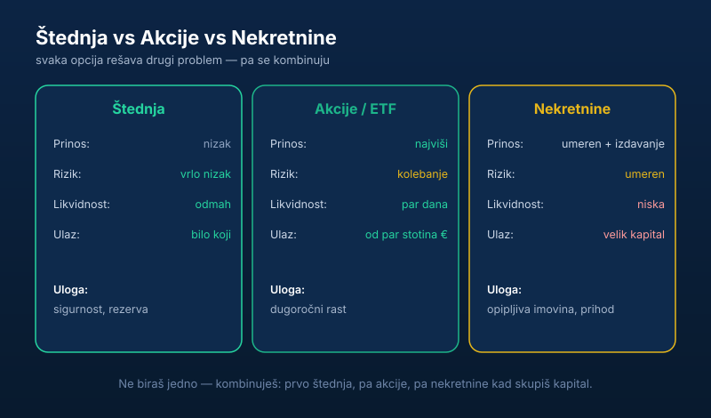

„Gde da uložim pare?" To je pitanje koje mi svako postavi. I svako očekuje jedan tačan odgovor. Nema ga. Ali ima jasna logika — pa hajde da je raščistimo.

Tri glavna izbora kod nas: **akcije, nekretnine i štednja.** Svaki ima svoju ulogu, svoju cenu i svoju zamku.

> **Napomena:** ovaj tekst je informativnog karaktera i ne predstavlja investicioni savet. Šta odgovara baš tebi zavisi od tvog horizonta, kapitala i tolerancije na rizik.

## Brzo poređenje

| | Štednja | Akcije / ETF | Nekretnine |
| --- | --- | --- | --- |
| **Prinos (dugoročno)** | nizak | istorijski najviši | umeren + prihod od izdavanja |
| **Rizik / trzanje** | vrlo nizak | visoko kolebanje | umeren, manje vidljiv |
| **Likvidnost** | odmah dostupno | par dana | niska (mesecima) |
| **Ulazni prag** | bilo koji iznos | od par stotina € | velik kapital |
| **Uloga** | sigurnost, rezerva | dugoročni rast | opipljiva imovina, prihod |

## Štednja: sigurna, ali ti ne pravi pare

Štednja ti je rezerva, ne investicija. Pare su ti dostupne odmah, ne možeš da izgubiš glavnicu, sve je mirno.

Problem? **Prinos je smešan, a inflacija ga pojede.** Štednja čuva pare od katastrofe, ali ih ne uvećava. Drži tu samo ono što ti treba kao [zaštitni jastuk — hitnu rezervu](/blog/hitna-rezerva-fond-za-crne-dane/) — ostalo neka radi. Zašto je to važno objasnili smo u tekstu [zašto je investiranje bitno](/blog/zasto-je-investiranje-bitno/). Dobra strana štednje je sigurnost: dinarski i devizni depoziti u bankama osigurani su do 50.000 evra po deponentu preko [Agencije za osiguranje depozita](https://www.aod.rs/), pa novac na štednji ne može da „nestane" — samo polako gubi trku sa inflacijom.

## Nekretnine: opipljive, ali spore i skupe za ulaz

Nekretnine kod nas svi vole — „cigla ne propada". I ima istine u tome: imaš nešto opipljivo, možeš da izdaješ i dobijaš mesečni prihod, a vrednost vremenom obično raste. (Ako te ova opcija zanima ozbiljno, pročitaj detaljan vodič [kako investirati u nekretnine u Srbiji](/blog/kako-investirati-u-nekretnine/) — sa računicom prinosa, porezom i greškama. Pre kupovine obavezno proveri vlasnika i terete preko [eKatastra](/blog/ekatastar-provera-vlasnika-nekretnine/).)

Ali budi realan oko mana:

- **Treba ti gomila para za ulaz** — nije za nekoga ko ima 2.000 evra sa strane.
- **Nisu likvidne** — ne možeš da prodaš pola stana kad ti hitno trebaju pare.
- **Imaju troškove** — porez, održavanje, problematični stanari.

Nekretnine su odlične, ali tek kad imaš ozbiljniji kapital i strpljenje.

## Akcije: najveći prinos, ali moraš da podneseš trzanje

Istorijski, akcije dugoročno donose najveći prinos od sve tri opcije. I dostupne su svima — možeš da kreneš i sa par stotina evra preko brokera, a [kako se to radi iz Srbije objasnili smo ovde](/blog/ulaganje-novca-u-akcije/).

Cena? **Vrednost ti skače gore-dole, ponekad i drastično.** Ako ti to kida živce i [prodaješ u panici čim padne](/blog/redovno-pracenje-cena-akcija/) — akcije nisu za tebe dok ne ojačaš živce. Ako možeš mirno da čekaš godinama, ovo je najmoćniji alat koji imaš. Da rizik ne bi zavisio od sudbine jedne firme, key je [diversifikacija preko širokog ETF-a](/blog/diversifikacija-portfolija/).

## Pa šta da radim?

Evo poštenog odgovora: **ne biraš jedno — kombinuješ.**

- Prvo napravi **štednju** kao zaštitu (to nije opciono).
- Onda gradi **akcije/ETF-ove** za dugoročni rast, redovno i strpljivo.
- A **nekretnine** dodaješ kad skupiš ozbiljniji kapital.

Redosled i logiku tih poteza razložili smo i u tekstu [gde uložiti prvih 1.000 evra](/blog/gde-uloziti-1000-evra/), a širu sliku daje [7 koraka do finansijske slobode](/blog/7-koraka-do-finansijske-slobode/).

Najgora greška nije da izabereš „pogrešno" — nego da iz straha ne izabereš ništa i ostaviš sve da kopni na tekućem računu. To je jedini siguran način da izgubiš.
