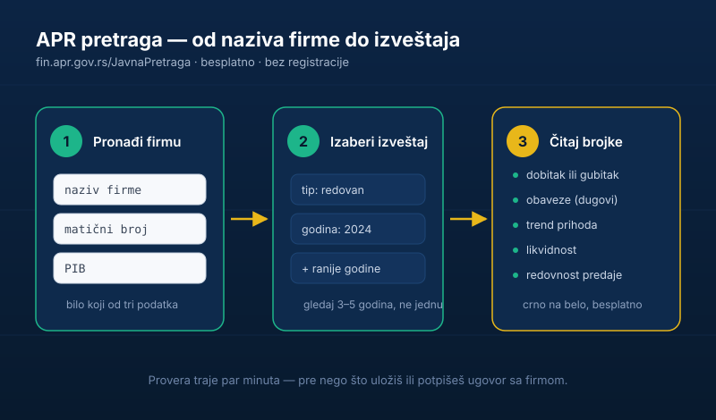

Ulaziš u posao sa nekom firmom. Razmišljaš da uložiš u domaću kompaniju. Ili samo hoćeš da znaš da li je firma sa kojom potpisuješ ugovor zdrava — ili tiho tone ka bankrotu.

Postoji besplatan alat koji ti to kaže crno na belo, a većina ljudi i ne zna da postoji. Zove se **APR pretraga finansijskih izveštaja**, traje par minuta i ne traži ni registraciju ni dinar.

Ovaj vodič ti pokazuje **tačno gde da tražiš, šta da ukucaš i šta da gledaš** u izveštaju — korak po korak, bez računovodstvenog žargona.

## Šta je APR i šta tačno možeš da proveriš

APR je **Agencija za privredne registre** — državna institucija koja vodi evidenciju o svim privrednim subjektima u Srbiji. Najvažnije za tebe: APR **javno objavljuje finansijske izveštaje firmi.**

To znači da za skoro svaku firmu možeš besplatno da vidiš:

- koliko **prihoduje** i da li prihodi rastu ili padaju,
- da li posluje sa **dobitkom ili gubitkom**,
- koliko ima **obaveza** (dugovanja),
- da li uopšte **uredno predaje** izveštaje.

Sve to sa telefona, bez odlaska na šalter. Ovo je [još jedan besplatan državni alat](/blog/ekatastar-provera-vlasnika-nekretnine/) koji ti može uštedeti hiljade evra — kao što kod nekretnina koristiš eKatastar za proveru vlasnika i hipoteke, ovde država već ima sve podatke o firmama, samo treba znati gde da gledaš.

## Zašto je ovo zlato vredno

Razmisli koliko ljudi uđe u poslove „na poverenje" i nasamare se. Koliko njih uloži u firmu jer im je „neko rekao da dobro stoji", a da nikad nisu pogledali brojke. Koliko isporuči robu na odloženo plaćanje firmi koja je već u blokadi.

A brojke su **javne**. Crno na belo. Treba samo da ih otvoriš.

Najčešće situacije u kojima ti APR spasava novac:

- **Pre ulaganja u domaću firmu.** Pre nego što uložiš u nečiji biznis ili kupiš udeo, vidiš da li firma stvarno zarađuje ili samo dobro priča.
- **Pre potpisivanja ugovora.** Pre nego što kreneš u saradnju ili isporučiš robu na odloženo, proveriš da li je partner solventan.
- **Pre zaposlenja.** Pre nego što daš otkaz i pređeš u novu firmu, vidiš da li ona uopšte stoji dobro.
- **Provera konkurencije.** Vidiš koliko konkurent prihoduje i kako mu se kreće posao.

Ista logika kao kad [pre kupovine akcija gledaš poslovanje kompanije](/blog/ulaganje-novca-u-akcije/) — samo što su ovde u pitanju domaće, neretko sasvim male firme.

## Šta ti treba pre pretrage

Da bi pretraga bila brza i precizna, pripremi bar jedan od ova tri podatka o firmi:

- **Naziv firme** — najlakše za pamćenje, ali najmanje precizno (više firmi može imati slično ime).
- **Matični broj** — jedinstvenih 8 cifara, identifikuje firmu bez greške.
- **PIB** — poreski identifikacioni broj, 9 cifara, takođe jedinstven.

Matični broj i PIB obično nađeš na **profakturi, ugovoru, fiskalnom računu, sajtu firme** ili u njihovom memorandumu i potpisu mejla. Ako imaš bilo koji od njih, koristi njega umesto naziva — izbegavaš da slučajno otvoriš pogrešnu firmu sa sličnim imenom.

## Kako da pretražiš firmu na APR-u (korak po korak)

1. Otvori **<a href="https://fin.apr.gov.rs/JavnaPretraga" target="_blank" rel="noopener">fin.apr.gov.rs/JavnaPretraga</a>** — to je *Javna pretraga* evidencije obveznika finansijskih izveštaja. Nema prijave, nema mejla, nema naknade.
2. **Ukucaj firmu** — po nazivu, matičnom broju ili PIB-u. Ako koristiš naziv, dobro pogledaj rezultate da otvoriš baš pravu firmu (uporedi matični broj ili sedište).
3. **Izaberi tip izveštaja i godinu** — izaberi vrstu (redovan godišnji, konsolidovani ili vanredni) i izveštajnu godinu. Obavezno otvori i **ranije godine**, ne samo poslednju.
4. **Otvori objavljeni izveštaj i čitaj brojke** — bilans stanja i bilans uspeha ti daju sve što ti treba za prvu procenu.

Cela operacija traje par minuta. Ako želiš širi kontekst o firmi (status, ko je osnivač, da li je u blokadi ili likvidaciji), tu je i opšta <a href="https://www.apr.gov.rs/registri/privredna-drustva/pretraga-podataka.2022.html" target="_blank" rel="noopener">pretraga podataka o privrednim društvima</a> na sajtu APR-a.

## Šta da gledaš u finansijskom izveštaju

Ne moraš da budeš računovođa. Za prvu procenu fokusiraj se na pet stvari.

### 1. Dobitak ili gubitak — i to kroz više godina

Otvori **bilans uspeha** i nađi neto rezultat: da li firma posluje sa **dobitkom** ili **gubitkom**. Ali ne gledaj samo jednu godinu — jedna dobra (ili loša) godina ne znači ništa. Gledaj **3–5 godina** i traži obrazac: stabilan dobitak, rast, stagnacija ili niz gubitaka.

### 2. Obaveze (koliko firma duguje)

U **bilansu stanja** pogledaj ukupne **obaveze**. Firma zatrpana dugovima je rizična, ma kako uspešno delovala spolja. Uporedi obaveze sa kapitalom i prihodima — ako su dugovi višestruko veći od svega ostalog, to je upozorenje. Posebno obrati pažnju na **negativan kapital**, koji znači da su obaveze pojele celu imovinu.

### 3. Trend prihoda

Poslovni prihodi koji iz godine u godinu **rastu** su dobar znak. Prihodi koji **padaju** više godina zaredom su znak da firma gubi posao — čak i ako je još u plusu. Trend ti govori više od apsolutnog broja.

### 4. Likvidnost (može li da plaća kad dospe)

Gruba provera: uporedi **obrtnu imovinu** (ono što se brzo pretvara u novac) sa **kratkoročnim obavezama** (ono što uskoro dospeva). Ako su kratkoročne obaveze veće od obrtne imovine, firma može imati problem da izmiri račune na vreme — a baš to te najpre pogađa ako čekaš naplatu od njih.

### 5. Redovnost predaje izveštaja

Možda i najjednostavniji signal: **da li firma uopšte uredno predaje izveštaje.** Aktivna, zdrava firma predaje na vreme. Rupe u godinama, kašnjenja ili potpuno odsustvo izveštaja su crvena zastavica sami po sebi.

## Crvene zastavice koje odmah vidiš

Bez dubokog kopanja, ove stvari treba da te zaustave:

- **Niz gubitaka** više godina zaredom.
- **Negativan kapital** — obaveze su veće od ukupne imovine.
- **Naglo opadanje prihoda** iz godine u godinu.
- **Nepredati ili stalno zakasneli** izveštaji.
- Firma je **u blokadi, likvidaciji ili stečaju** (to vidiš u opštoj pretrazi privrednih subjekata).

Ako vidiš bilo koju od ovih, to ne mora da znači prevaru — ali znači da pre svake uplate ili potpisa tražiš objašnjenje, garancije ili savet knjigovođe.

## Gde APR prestaje (ograničenja)

APR je odličan za **brzu, besplatnu proveru**, ali budi svestan granica:

- Podaci iz javne pretrage su **istorijski** — pokazuju prošlu godinu ili dve, ne trenutno stanje na računu.
- **Paušalno oporezovani preduzetnici** uglavnom nemaju obavezu istog izveštavanja, pa za njih nećeš naći klasičan bilans.
- Izveštaj ti pokazuje **brojke, ali ne i priču iza njih** — gubitak može biti zbog jednokratne investicije, a ne propadanja.

Za **ozbiljnu odluku** (veći ulog, veliki ugovor) kombinuj APR sa drugim proverama: opšta pretraga statusa firme, [provera nekretnina i tereta preko eKatastra](/blog/ekatastar-provera-vlasnika-nekretnine/) ako je u igri imovina, i po potrebi savet knjigovođe ili advokata. Pravilo je isto kao svuda u [pametnom upravljanju novcem](/blog/kako-pametno-upravljati-finansijama/): **screening sam, ekspert pred potpis.**

## Suština

Informacija koja te može spasti od loše investicije ili lošeg posla stoji ti **besplatno na dohvat ruke**. Ljudi gube hiljade evra jer su lenji da provere ono što je javno.

Pre nego što daš pare ili potpišeš ugovor — otvori APR, ukucaj firmu i pogledaj brojke. Pet minuta provere može da ti sačuva godinu nerava. A kada već gradiš naviku da proveravaš pre nego što rizikuješ, [sledeći korak je da znaš kako da pametno raspoređuješ taj novac](/blog/7-koraka-do-finansijske-slobode/).
