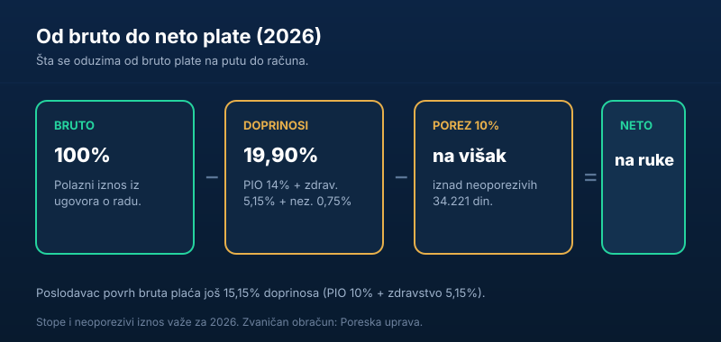

Ugovoriš platu, a na račun ti legne osetno manje. Gde je razlika? Između **bruto** i **neto** plate stoje porez i doprinosi — i vredi razumeti kako se računaju, bilo da si zaposlen, bilo da zapošljavaš. U ovom vodiču objašnjavamo obračun za 2026, sa stopama i primerom korak po korak.

Kratko, za one kojima treba odmah:

> Od **bruto** plate oduzima se **19,90% doprinosa** (na teret zaposlenog) i **10% poreza** na deo iznad neoporezivih **34.221 din** — ostatak je **neto**. Poslodavac povrh toga plaća još **15,15%** doprinosa.

## Bruto, neto i bruto 2 — tri pojma

Da bismo izbegli zabunu, prvo razdvojimo tri iznosa koji se stalno mešaju:

- **Neto plata** — ono što zaposleni **dobija na račun**.
- **Bruto plata** — neto **uvećan za porez i doprinose** na teret zaposlenog; to je iznos iz ugovora o radu.
- **Bruto 2** — bruto **plus doprinosi na teret poslodavca**; to je **stvarni trošak** firme.

Kada poslodavac kaže „plata je 100.000", obično misli na bruto. Kada zaposleni kaže „primam 100.000", misli na neto. Razlika je velika — i u nju ide ovaj porez i doprinosi.

## Koji se porez i doprinosi plaćaju (2026)

Na platu se u Srbiji plaćaju **doprinosi za obavezno socijalno osiguranje** i **porez na zarade**. Stope za 2026:

| Stavka | Na teret zaposlenog | Na teret poslodavca |
|---|---|---|
| PIO (penzijsko) | 14% | 10% |
| Zdravstveno | 5,15% | 5,15% |
| Nezaposlenost | 0,75% | — |
| **Ukupno doprinosi** | **19,90%** | **15,15%** |
| Porez na zarade | 10% (na osnovicu iznad neoporezivog) | — |

Zaposleni „oseti" 19,90% doprinosa + porez, jer se odbijaju iz njegove bruto plate. Poslodavac dodatno plaća 15,15% **povrh** bruta — to je deo koji zaposleni ne vidi na platnom listiću, ali postoji.

## Neoporezivi iznos — deo plate bez poreza

Porez na zarade se **ne plaća na celu platu**. Prvo se odbija **neoporezivi iznos**, koji od 1. januara 2026. iznosi **34.221 dinar** mesečno (povećan sa ranijih 28.423). Tek na iznos **iznad** tog dela primenjuje se stopa od 10%.

To znači da niže plate srazmerno manje opterećuje porez — jer veći deo njihove plate „upada" u neoporezivi iznos.

## Primer obračuna

Uzmimo **bruto platu od 100.000 dinara** i provucimo je kroz obračun za 2026:

| Korak | Računica | Iznos |
|---|---|---|
| Bruto plata | — | 100.000 din |
| Doprinosi (zaposleni) | 100.000 × 19,90% | −19.900 din |
| Poreska osnovica | 100.000 − 34.221 | 65.779 din |
| Porez na zarade | 65.779 × 10% | −6.578 din |
| **Neto plata** | 100.000 − 19.900 − 6.578 | **≈ 73.522 din** |

Povrh toga, poslodavac plaća još 15,15% doprinosa (100.000 × 15,15% = 15.150 din), pa je **ukupan trošak rada (bruto 2)** oko **115.150 din**. Drugim rečima, da bi zaposleni dobio ~73.500 din na ruke, firmu to košta ~115.000.

> Brojevi su ilustrativni i zaokruženi. Za tačan, zvaničan obračun koristi kalkulatore i podatke [Poreske uprave](https://www.purs.gov.rs/).

## Minimalna i prosečna plata

Dva orijentira koja se često traže:

- **Minimalna plata** se u Srbiji obračunava po **minimalnoj ceni rada po satu**, pa neto iznos varira od meseca do meseca u zavisnosti od broja radnih sati.
- **Prosečna plata** je statistički pokazatelj koji objavljuje Republički zavod za statistiku i koristi se, između ostalog, kao osnova za razne obračune (uključujući i [penzijske parametre](/blog/kako-se-racuna-penzija-u-srbiji/)).

Pošto se i minimalac i neoporezivi iznos menjaju, vredi ih proveriti za tekuću godinu pre nego što praviš [budžet](/blog/novac-i-budzet/).

### Minimalna plata u 2026.

Srbija **ne propisuje fiksni mesečni minimalac**, već **minimalnu cenu rada po satu**. Od 1. januara 2026. ona iznosi **371 dinar (neto) po radnom času**, što je oko 10% više nego u prethodnom periodu.

Pošto broj radnih sati varira od meseca do meseca (otprilike 160–184 sata, zavisno od kalendara i praznika), i **mesečni minimalac varira**. Za referentni mesec od 174 sata to je oko **64.554 dinara** neto. Razlika između meseca sa najmanje i najviše sati ume da bude i do 9.000 dinara — pa minimalac u januaru i u nekom „dužem" mesecu nije isti iznos.

### Šta sa drugim primanjima

Plata iz radnog odnosa nije jedini oblik prihoda od rada. **Ugovor o delu, autorski ugovor i privremeni i povremeni poslovi** oporezuju se po sopstvenim pravilima — drugačijim stopama i osnovicama nego redovna zarada. Ako radiš honorarno ili kao [frilenser](/blog/pausalno-oporezivanje/), tvoja efektivna „neto na ruke" računica izgleda drugačije od ove za platu, pa je ne treba mehanički preslikavati.

## Zašto je ovo važno da znaš

Razumevanje obračuna plate nije samo „knjigovodstvo". Pomaže ti da:

- **pregovaraš** o plati znajući razliku bruto/neto,
- **proveriš** da li ti je platni listić ispravan,
- **planiraš** lične finansije na osnovu onoga što stvarno stiže na račun.

Kada znaš koliko ti realno ostaje, lakše je [napraviti budžet](/blog/novac-i-budzet/) i [početi da štediš](/blog/kako-pametno-upravljati-finansijama/) — jer planiraš sa stvarnim, a ne ugovorenim brojem.

## Zaključak

Put od **bruto do neto** plate u 2026. vodi kroz **19,90% doprinosa** na teret zaposlenog i **10% poreza** na deo iznad neoporezivih **34.221 din**, dok poslodavac dodatno snosi **15,15%** doprinosa. Na primeru bruto plate od 100.000 din, na račun stiže oko 73.500 din, a firmu rad košta oko 115.000. Pošto se stope i neoporezivi iznos menjaju, za precizan obračun uvek proveri aktuelne podatke [Poreske uprave](https://www.purs.gov.rs/).

---

*Ovaj tekst je informativnog karaktera i ne predstavlja poreski ni finansijski savet. Stope poreza i doprinosa, neoporezivi iznos i način obračuna utvrđuje i objavljuje Poreska uprava Republike Srbije. Iznosi navedeni za 2026. podložni su promenama.*
