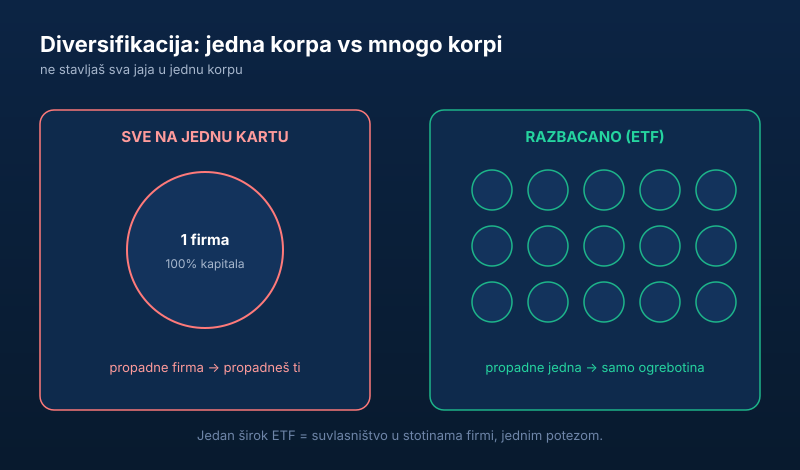

Upoznao sam čoveka koji je sve svoje pare uložio u akcije jedne firme jer mu je „neko rekao da će eksplodirati". Firma je propala. On je ostao bez svega.

Nije problem bio u tome što je investirao. Problem je bio što je sve stavio na jednu kartu. Ovaj tekst objašnjava **šta je diversifikacija portfolija**, koliko ti je zaista potrebno i zašto je širok ETF najlakši način da je postigneš.

> **Napomena:** ovaj tekst je informativnog karaktera i ne predstavlja investicioni savet. Raspored portfolija zavisi od tvog horizonta i tolerancije na rizik — procenu donosiš sam, po potrebi uz licenciranog savetnika.

## Šta je diversifikacija

Diversifikacija je fensi reč za nešto što ti je baba znala: **ne stavljaj sva jaja u jednu korpu.**

Ako ti padne jedna korpa, izgubiš samo ta jaja — ne sva. Isto je sa parama: ako uložiš u mnogo različitih stvari, propast jedne te neće srušiti.

## Zašto je ovo toliko bitno

Nijedna pojedinačna firma, ma koliko delovala sigurno, nije imuna na propast. Setimo se koliko je nekad „sigurnih" gigantskih kompanija nestalo. Da si sve uložio u njih — gotov si.

Ali ako tvoj novac radi kroz stotine firmi odjednom, propast jedne ili dve je samo ogrebotina, ne smrtonosna rana. Tržište kao celina raste dugoročno, čak i kad pojedinačne firme padaju.

To je ista logika zbog koje [ulaganje u akcije nije kockanje](/blog/investiranje-nije-kockanje/) — dok god ne kladiš sve na jedan ishod.

## ETF: diversifikacija za lenje (u dobrom smislu)

Ne moraš ručno da kupuješ stotinu akcija da bi bio diversifikovan. Za to postoje ETF-ovi.

ETF je, jednostavno rečeno, korpa koja u sebi već sadrži mnogo akcija. Kupiš jedan ETF koji prati, recimo, celo svetsko tržište — i odjednom si suvlasnik u hiljadama firmi širom sveta. Jednim potezom, sa malim novcem.

Zato su ETF-ovi savršeni za početnike: instant diversifikacija, niski troškovi, bez potrebe da analiziraš pojedinačne firme. Kako se ETF kupuje iz Srbije objasnili smo u vodiču [ulaganje novca u akcije](/blog/ulaganje-novca-u-akcije/), a zašto je često bolji od skupih fondova u tekstu [investicioni fondovi vs ETF](/blog/zasto-ne-investirati-u-fondove/). ETF-ovi i druge hartije od vrednosti su regulisani instrumenti — tržište u Srbiji nadzire [Komisija za hartije od vrednosti](https://www.sec.gov.rs/).

## Ali nemoj ni da preteraš

Diversifikacija ne znači da kupiš 50 različitih stvari koje ne razumeš. To je samo haos sa više koraka.

Za većinu ljudi, par širokih ETF-ova je sasvim dovoljno da bude pametno razbacano. Ne komplikuj. Dodavanje desete sličnice ne smanjuje rizik — samo otežava preglednost i diže troškove.

Vredi razumeti i granicu: diversifikacija uklanja rizik pojedinačne firme, ali ne i rizik celog tržišta. Kad padne sve, padaju i široki fondovi — i to je normalno. Od tog pada te ne čuva broj pozicija, nego dug horizont i to što [ne ulažeš novac koji ti treba uskoro](/blog/hitna-rezerva-fond-za-crne-dane/) i ne [prodaješ u panici](/blog/redovno-pracenje-cena-akcija/).

## Diversifikacija i izvan akcija

Diversifikacija ne staje na akcijama. Možeš da razbacaš i kroz klase imovine — pa logika „ne sve na jedno" važi i kad biraš između [akcija, nekretnina i štednje](/blog/akcije-nekretnine-ili-stednja/). Sigurna štednja, široki ETF i (kad skupiš kapital) nekretnina igraju različite uloge: jedno čuva, drugo raste, treće daje opipljiv prihod.

## Suština

Tvoj cilj nije da pogodiš jednog pobednika. Tvoj cilj je da ne izgubiš sve ako pogrešiš. Diversifikacija ti to omogućava — i zato nije opciona.

Onaj ko se kladi na jednu kartu pre ili kasnije izgubi. Onaj ko razbaca rizik — preživi i raste.
