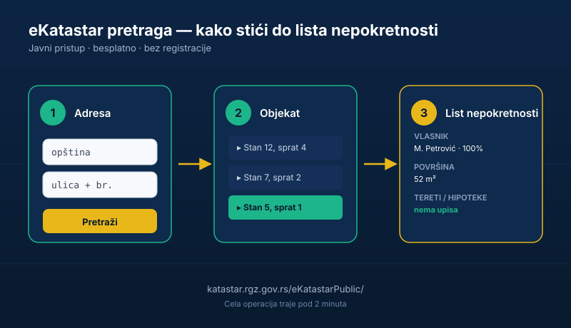

Daješ [kaparu](/blog/hitna-rezerva-fond-za-crne-dane) za stan koji unajmljuješ. [Kupuješ vikendicu](/blog/kako-investirati-u-nekretnine) od „prijatelja prijatelja". Plaćaš avans za parcelu koja te čeka već dve godine.

A nisi proverio ni jednu jedinu stvar: da li ti čovek koji uzima novac uopšte ima pravo da ti je da.

Postoji besplatan državni alat koji ti za dva minuta kaže ko je pravi vlasnik, koliko ih ima, i da li na nekretnini visi hipoteka. Zove se **eKatastar** — i većina ljudi i ne zna da postoji.

## Šta je eKatastar

[eKatastar](https://katastar.rgz.gov.rs/eKatastarPublic/) je elektronski pristup bazi <a href="https://www.rgz.gov.rs/e-katastar" target="_blank" rel="noopener">Republičkog geodetskog zavoda (RGZ)</a>, u kojoj se vodi evidencija o svim upisanim nekretninama u Srbiji — stanovima, kućama, parcelama, poslovnim prostorima.

Za svaku tu nekretninu možeš da vidiš osnovne podatke: ko je vlasnik (ime i prezime, ili naziv firme), koliki je udeo svakog vlasnika, kolika je površina, i — najvažnije — da li postoje tereti i hipoteke.

Sve to besplatno, sa telefona ili kompjutera, bez registracije i bez odlaska na šalter. Ovo je [još jedan besplatan državni alat](/blog/apr-pretraga-finansijskih-izvestaja) koji ti može spasti hiljade evra — a o kome niko ne priča.

## Zašto je ovo zlato vredno

Zamisli koliko ljudi je platilo kaparu osobi koja im je „pokazala stan" — a ispostavilo se da stan nije njen. Ili je kupilo zemlju koja je već pod hipotekom kod banke. Ili je dalo avans za parcelu koja ima [troje suvlasnika](/blog/akcije-nekretnine-ili-stednja), od kojih dvoje nije ni znalo da se prodaje.

Ovo nisu izmišljeni scenariji. To se dešava svakog meseca. I skoro uvek je moglo da se spreči proverom koja traje koliko i jedna pretraga na Guglu.

Najčešće prevare i zamke koje eKatastar odmah razotkriva:

- **Lažni izdavac.** Neko ti iznajmljuje stan koji nije njegov. Ime u katastru ne odgovara imenu na ugovoru — kraj priče.
- **Suvlasništvo.** Stan ima troje vlasnika (česta situacija kod nasleđa), a ugovor potpisuje samo jedan. Bez saglasnosti svih, ugovor je sporan.
- **Hipoteka.** Nekretnina je pod založnim pravom banke ili nekog poverioca. Ako tu nekretninu kupiš ili uzmeš pod hipoteku, dug ide uz nju.
- **Zabeležbe i sporovi.** Na listu nepokretnosti može da bude upisan sudski spor ili zabrana raspolaganja. Crveno svetlo.

## Šta da gledaš u listu nepokretnosti

Kada nađeš nekretninu, dobiješ dokument koji se zove **list nepokretnosti**. Ne moraš da budeš pravnik da bi razumeo ono što ti treba. Fokusiraj se na sledeće:

- **Vlasnik (nosilac prava).** Da li se ime poklapa sa imenom osobe koja ti prodaje, izdaje ili traži novac. Ako ne — stoj.
- **Udeo (oblik svojine).** Ima li nekretnina jednog ili više vlasnika. Pišu i procentualni udeli. Sa više vlasnika treba pristanak svih.
- **Tereti, hipoteke i zabeležbe.** Sekcija koja ti govori da li je nekretnina opterećena. Ako vidiš upis hipoteke ili spora — pre svake uplate vodi advokata.
- **Površina i vrsta objekta.** Da li se opisom slaže sa onim što ti je pokazano. Stan od 65 m² u oglasu, a u katastru piše 48 m² — postavi pitanje.

## Kako da koristiš (korak po korak)

1. Otvori sajt **katastar.rgz.gov.rs/eKatastarPublic/** ili na sajtu RGZ-a (rgz.gov.rs) izaberi „Javni pristup".
2. Izaberi opciju **pretrage po adresi** (najlakše ako kupuješ stan ili kuću) ili **po broju parcele** (ako kupuješ zemljište).
3. Ukucaj opštinu, ulicu i kućni broj. Sistem ti izlistuje nepokretnosti na toj adresi.
4. Klikni na konkretan objekat ili stan, otvori list nepokretnosti i čitaj.

Cela operacija traje pod dva minuta. Nema prijave, nema mejla, nema mobilnog telefona, nema čekanja.

## Kada javni pristup nije dovoljan

Javni pristup je odličan za prvu proveru. Ali za **ozbiljnu transakciju** (kupovina, dizanje kredita, sudski postupak) trebaće ti **overen prepis lista nepokretnosti** — taj dokument se vadi u nadležnoj službi za katastar ili preko <a href="https://euprava.gov.rs/republicki-geodetski-zavod" target="_blank" rel="noopener">portala eUprava</a>, plaća se taksa, i jedino on ima pravnu snagu.

Pravilo je jednostavno: **javni pristup za screening, overen prepis pre potpisa.**

## Suština

Hiljade ljudi godišnje izgube ozbiljan novac zato što su preskočili proveru koja je besplatna, brza i dostupna svakom čoveku sa telefonom. Ovo je tačka u kojoj se vidi razlika između onog ko zna [zašto je investiranje bitno](/blog/zasto-je-investiranje-bitno) i onog ko prati šta priča komšija.

Pre nego što daš kaparu — proveri vlasnika. Pre nego što potpišeš ugovor o najmu — proveri vlasnika. Pre nego što kupiš zemljište — proveri tereti i hipoteke.

eKatastar je upravo za to. Ne koristiti ga je luksuz koji ne možeš sebi da priuštiš.
