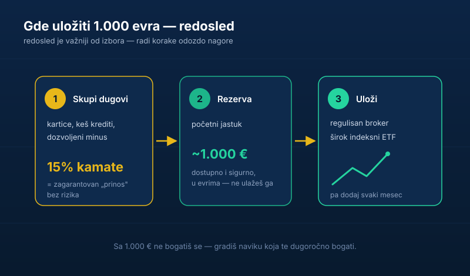

Skupio si prvih 1.000 evra. Čestitam — to je više nego što većina ikad odvoji. A sad veliko pitanje: **gde uložiti 1.000 evra** da ne pogrešiš?

Pre nego što počneš da maštaš o akcijama koje će ti se „udesetostručiti", stani. Redosled je ovde važniji od izbora. Loš redosled sa dobrom investicijom i dalje te može vratiti na početak.

## Prvo pitanje: imaš li dugove i rezervu?

Pre bilo kakvog investiranja, odgovori iskreno na dva pitanja:

- **Imaš li dugove sa kamatom** (kartice, keš krediti, dozvoljeni minus)? Ako imaš — tih 1.000 evra ide na njih. Otplata duga sa 15% kamate ti je „prinos" od 15% bez ikakvog rizika. Nijedna investicija ti to ne garantuje.
- **Imaš li ikakvu rezervu za hitne slučajeve?** Ako nemaš, ovih 1.000 evra je tvoj početni zaštitni jastuk. Ne investiraš poslednje pare koje imaš. O tome zašto je [rezerva korak broj jedan pišemo ovde](/blog/hitna-rezerva-fond-za-crne-dane).

Ako si na oba pitanja rekao „čisto sam" — odlično, idemo dalje.

## Šta NE da radiš sa 1.000 evra

- **Ne juriš jednu „vruću" akciju** za koju si čuo da će eksplodirati. To nije investiranje, to je [kockanje sa boljim PR-om](/blog/investiranje-nije-kockanje).
- **Ne ulaziš u nešto što ne razumeš** samo zato što svi pričaju o tome — od kripta do „sigurnih" šema sa visokim prinosom.
- **Ne čekaš da skupiš „ozbiljniju sumu"** — počni sa onim što imaš. Vreme na tržištu je vrednije od veličine prvog uloga.
- **Ne stavljaš sve na jednu kartu.** Jedna firma može da propadne; celo tržište istorijski raste. Zato je [diversifikacija obavezna](/blog/diversifikacija-portfolija).

## Šta DA radiš

Ako su dugovi i rezerva rešeni, sa 1.000 evra najpametnije je:

1. **Otvori nalog kod ozbiljnog, regulisanog brokera.** Kako se to radi iz Srbije — izbor brokera, verifikacija i prva uplata — objasnili smo u vodiču [ulaganje novca u akcije](/blog/ulaganje-novca-u-akcije).
2. **Kupi širok ETF** koji prati celo tržište. Jednim potezom razbacuješ rizik na hiljade firmi. Ako se dvoumiš između fonda i ETF-a, pogledaj [zašto provizije fondova često pojedu prinos](/blog/zasto-ne-investirati-u-fondove).
3. **Nastavi da dodaješ redovno.** Tih 1.000 evra nije kraj — to je prvi ulog. Mnogo je važnije da nastaviš da uplaćuješ svaki mesec nego koliki ti je bio prvi iznos.

## A ako ne želim u akcije?

Legitimno pitanje. Ako ti je horizont kratak (novac ti treba za godinu-dve), akcije nisu mesto za njega — tu je bolja sigurna, dostupna štednja. Ako razmišljaš šire o tome gde uopšte da staviš pare, [poređenje akcija, nekretnina i štednje je u zasebnom tekstu](/blog/akcije-nekretnine-ili-stednja). Sa 1.000 evra, doduše, nekretnine otpadaju same od sebe — ostaje ti štednja za kratak rok ili ETF za dug.

> **Napomena:** ovaj tekst je informativnog karaktera i ne predstavlja investicioni savet. Procenu sopstvene situacije i rizika donosiš sam.

## Najvažnija lekcija

Sa 1.000 evra nećeš se obogatiti. Ali tih 1.000 evra te uči naviku koja hoće. Početak nije u iznosu — početak je u tome da konačno staviš pare da rade umesto da kopne.

Mali ulog danas, ponovljen stotinu puta kroz godine, pobeđuje veliki ulog koji čekaš celog života. A kad ti se prvih 1.000 pretvori u prvih 10.000, već ćeš imati naviku — i to je prava nagrada.
