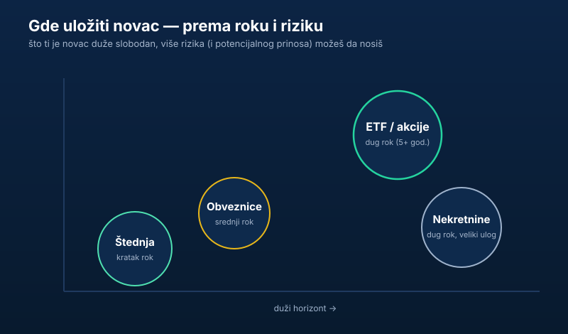

„**Gde uložiti novac** da ne stoji mrtav na računu?” — to je pitanje koje pre ili kasnije postavi svako ko skupi nešto sa strane. Dobra vest: opcija ima više nego što se obično misli. Loša vest: ne postoji jedna čarobna opcija koja je najbolja za sve.

Ovaj tekst je mapa, ne recept. Proći ćemo kroz sve glavne načine da uložiš novac u Srbiji — šta nose, koje rizike kriju i kome odgovaraju — da bi sam doneo odluku koja ima smisla za tvoju situaciju.

## Pre nego što uložiš ijedan dinar

Najpametnije ulaganje često nije nikakvo ulaganje — nego sređivanje osnova. Pre nego što kreneš da biraš između ETF-a i nekretnine, odgovori iskreno na dva pitanja:

- **Imaš li skupe dugove?** Kartice, keš krediti i dozvoljeni minus često nose kamatu od 10–20%. Otplata takvog duga je „prinos” koji nijedna investicija ne garantuje. Tu novac ide prvi.
- **Imaš li rezervu za hitne slučajeve?** Ako ti kvar na kolima ili gubitak posla odmah ruše sve planove, prvo napravi [hitnu rezervu — fond za crne dane](/blog/hitna-rezerva-fond-za-crne-dane/). Tek onda ulažeš novac koji ti ne treba odmah.

Ako su ta dva temelja postavljena, prelazimo na opcije. Šira slika o tome zašto je uopšte vredno staviti pare da rade je u tekstu [zašto je investiranje bitno](/blog/zasto-je-investiranje-bitno/).

## 1. Štednja u banci — za novac koji ti treba uskoro

Klasična štednja nije „investiranje” u pravom smislu, ali ima jasnu ulogu: čuva novac koji ti treba u narednih godinu-dve. Oročena štednja nosi unapred poznatu kamatu, a *a vista* (po viđenju) ti je dostupna u svakom trenutku.

Najvažnije: depoziti u bankama u Srbiji osigurani su **do 50.000 evra po deponentu po banci** preko Agencije za osiguranje depozita. To znači da i u slučaju stečaja banke tvoj novac do tog iznosa nije ugrožen.

- **Kome odgovara:** svima — kao mesto za rezervu i za ciljeve na kratak rok.
- **Rizik:** mali; glavni „neprijatelj” je inflacija koja vremenom jede vrednost.
- **Dinari ili evri?** Dinarska štednja obično nosi veću kamatu, ali snosiš rizik kursa; evarska je mirnija uz nižu kamatu.

## 2. Državne obveznice — pozajmiš državi uz kamatu

Kupovinom državnih obveznica Republike Srbije praktično pozajmljuješ novac državi, koja ti ga vraća uz unapred dogovorenu kamatu. To je tradicionalno jedan od mirnijih oblika ulaganja, negde između štednje i akcija po riziku i prinosu.

- **Kome odgovara:** opreznijim ulagačima koji žele nešto veći prinos od štednje uz nizak rizik.
- **Na šta da paziš:** rok dospeća i da li obveznicu možeš da prodaš pre roka ako ti zatreba novac. Aktuelne uslove proveri na sajtu Ministarstva finansija i [Narodne banke Srbije](https://www.nbs.rs).

## 3. Akcije i ETF — za dug rok i veći prinos

Kada ljudi kažu „investiranje”, najčešće misle na ovo. Kupovinom **akcija** postaješ suvlasnik firme; kupovinom **ETF-a** jednim potezom kupuješ sitne delove stotina ili hiljada firmi odjednom. Na dug rok (5+ godina) široko tržište akcija istorijski donosi najviše — ali uz oscilacije koje moraš da podneseš.

Kako se to konkretno radi iz Srbije — izbor regulisanog brokera, otvaranje naloga i prva uplata — objasnili smo korak po korak u vodiču [ulaganje novca u akcije](/blog/ulaganje-novca-u-akcije/). Dve stvari su ključne za početnika:

- **Diversifikacija.** Ne stavljaj sve na jednu firmu. Zašto je [diversifikacija obavezna](/blog/diversifikacija-portfolija/) i kako je širok ETF rešava jednim potezom.
- **Troškovi.** Visoke provizije i naknade tiho jedu prinos. Zato pre aktivnih fondova pogledaj [zašto provizije fondova često pojedu zaradu](/blog/zasto-ne-investirati-u-fondove/).

> **Napomena:** ovaj tekst je informativnog karaktera i ne predstavlja investicioni savet. Tržište akcija nosi rizik gubitka i procenu sopstvene situacije donosiš sam.

## 4. Dobrovoljni penzioni fondovi — za dalek cilj

Dobrovoljni penzioni fond je način da dugoročno odvajaš za penziju, često uz određene poreske olakšice. Novac je vezan do penzionih uslova, pa nije za ciljeve na kratak rok, ali kao dodatni „treći stub” uz državnu penziju ume da ima smisla.

- **Kome odgovara:** onima koji žele disciplinovano, dugoročno odvajanje za penziju.
- **Na šta da paziš:** naknade fonda i pravila isplate.

## 5. Nekretnine — veliki ulog, opipljiva imovina

Nekretnine su omiljena tema u Srbiji i mogu da budu dobra dugoročna investicija — kroz rast vrednosti i kroz prihod od izdavanja. Ali traže veliki početni kapital, manje su „tečne” (ne prodaš ih za dan) i nose troškove održavanja i poreza.

Pre kupovine obavezno proveri vlasništvo i teret nad nekretninom preko [eKatastra](/blog/ekatastar-provera-vlasnika-nekretnine/), a šire o ulasku u ovu klasu imovine piše [kako investirati u nekretnine](/blog/kako-investirati-u-nekretnine/). Ako se dvoumiš između ove tri velike kategorije, pogledaj direktno poređenje: [akcije, nekretnine ili štednja](/blog/akcije-nekretnine-ili-stednja/).

## 6. Zlato i alternative — mali deo, ne ceo plan

Zlato, kripto i slične „alternativne” stvari privlače pažnju, ali su nestabilne i ne donose prihod sami po sebi (nema kamate ni dividende). Mogu da budu mali začin u portfelju, ali su loš temelj. Sve što obećava brz i siguran visok prinos tretiraj kao crvenu zastavicu — više o toj granici u tekstu [investiranje nije kockanje](/blog/investiranje-nije-kockanje/).

## Kako da izabereš: rok + rizik

Umesto da tražiš „najbolju” opciju, postavi sebi dva pitanja:

1. **Kada će mi taj novac trebati?** Za godinu-dve → štednja/obveznice. Za 5+ godina → ETF/akcije, eventualno nekretnine.
2. **Koliko mirno spavam kad vrednost padne?** Ako te pad od 20% tera da prodaš u panici, smanji udeo akcija i pojačaj sigurniji deo.

U praksi većina ljudi ne bira jednu opciju nego ih kombinuje: rezerva u štednji, dugoročni deo u ETF-u, možda nekretnina kad se skupi dovoljno. Koliko god da je iznos, počni — i ako imaš tačno hiljadu evra, imamo i konkretan redosled poteza u tekstu [gde uložiti 1.000 evra](/blog/gde-uloziti-1000-evra/).

## I na kraju — porez

Na zaradu od ulaganja se plaća porez. U Srbiji se na kapitalni dobitak od akcija, ETF-ova i kripta po pravilu plaća **15%**, uz olakšice i rokove koje smo razložili u tekstu [porez na kapitalni dobitak](/blog/porez-na-kapitalni-dobitak/). Uračunaj porez u plan od početka da te ne iznenadi.

## Zaključak

Ne postoji tajna opcija za koju „samo bogati znaju”. Postoje obične, dostupne mogućnosti — štednja, obveznice, ETF, penzioni fondovi, nekretnine — i jedno pravilo koje vredi više od svake: **sredi osnove, pa ulaži redovno i u skladu sa rokom i rizikom koji nosiš.** Dosadno? Možda. Ali upravo to dosadno, ponovljeno kroz godine, gradi imovinu.
