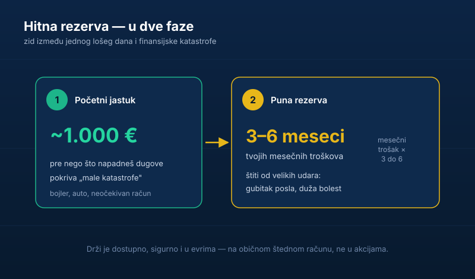

Pitaj se nešto pošteno: ako ti sutra pukne bojler, ode ti auto na servis i dobiješ neočekivani račun — sve u istoj nedelji — odakle bi platio? Ako je odgovor „kreditna kartica" ili „pozajmio bih" — nemaš zaštitu. I to te čini ranjivim.

Ta zaštita ima ime: **hitna rezerva**, ili narodski — fond za crne dane. Ovaj tekst ti pokazuje koliko ti treba, gde da je držiš i zašto je to prvi potez, pre svega ostalog.

## Zašto je rezerva korak broj jedan

Pre investiranja, pre ubrzane otplate dugova, pre svega — treba ti rezerva za crne dane. Zašto baš prvo?

Zato što život ne čeka da ti budeš spreman. Kvarovi, bolesti, otkazi, neočekivani troškovi — to nije pitanje „da li", nego „kada". I ako te zateknu bez rezerve, jedini izlaz su dugovi. A dugovi te vraćaju na početak, ili gore.

Rezerva je zid između jednog lošeg dana i finansijske katastrofe. Zato je ona i [prvi korak ka finansijskoj slobodi](/blog/7-koraka-do-finansijske-slobode), pre svake investicije.

## Koliko ti treba

Radi se u dve faze:

- **Prva rezerva: oko 1.000 evra.** To je početni jastuk koji sklanjaš pre nego što napadneš dugove. Pokriva većinu „malih katastrofa" da te ne vrate u minus.
- **Puna rezerva: 3 do 6 meseci troškova.** To gradiš kasnije, kad rešiš skupe dugove. Ovo te čuva od velikih udara — gubitka posla, duže bolesti.

Sedi i izračunaj koliko ti tačno treba mesečno da preživiš — ako još nemaš tu cifru, [napravi budžet za 30 minuta](/blog/novac-i-budzet) pa će ti sama iskočiti. Pomnoži taj mesečni minimum sa tri do šest. To je tvoj cilj.

## Gde da je držiš

Rezerva nije investicija i ne sme da bude. Pravila su jednostavna:

- **Mora da bude dostupna odmah.** Ne vredi ti rezerva zarobljena u nečemu što ne možeš brzo da unovčiš.
- **Mora da bude sigurna.** Ne ulažeš rezervu u akcije — ako ti zatreba baš kad [tržište padne, gotov si](/blog/redovno-pracenje-cena-akcija).
- **Drži je u evrima.** Zaštita od inflacije i pada dinara. Istorija nas je tome naučila.

Najbolje mesto je običan, dostupan štedni račun. Dosadno? Da. Ali rezerva i treba da bude dosadna — njen posao je da bude tu kad zatreba, ne da pravi pare.

Jedna korisna sigurnosna mreža: štednja u bankama u Srbiji je **osigurana do 50.000 evra po deponentu i banci** preko <a href="https://www.aod.rs/" target="_blank" rel="noopener">Agencije za osiguranje depozita</a> (najavljeno je i podizanje tog iznosa, pa zvaničan limit proveri na <a href="https://www.nbs.rs/" target="_blank" rel="noopener">sajtu NBS-a</a> ili Agencije). Za rezervu od par hiljada evra to znači da ti je novac u regulisanoj banci miran i zaštićen.

## Najveća greška

Najveća greška je preskočiti ovaj korak i odmah jurnuti u investiranje jer je „uzbudljivije". A onda, kad život udari, prodaješ investicije u najgorem trenutku, na gubitku, samo da pokriješ hitan trošak.

Rezerva ti omogućava da [investiraš mirno](/blog/zasto-je-investiranje-bitno) — jer znaš da te jedan loš dan neće srušiti. Bez nje, ti investiraš na klimavim nogama, i prvi pad te izbaci iz igre.

## Suština

Hitna rezerva nije uzbudljiva, ne donosi prinos i niko se njome ne hvali. Ali ona je temelj na kom stoji sve drugo — budžet, otplata dugova, investiranje.

Napravi prvu rezervu pre svega ostalog. Oko 1.000 evra na poseban račun, pa onda gradi dalje. To je najdosadniji i najvažniji potez u tvojim finansijama.
