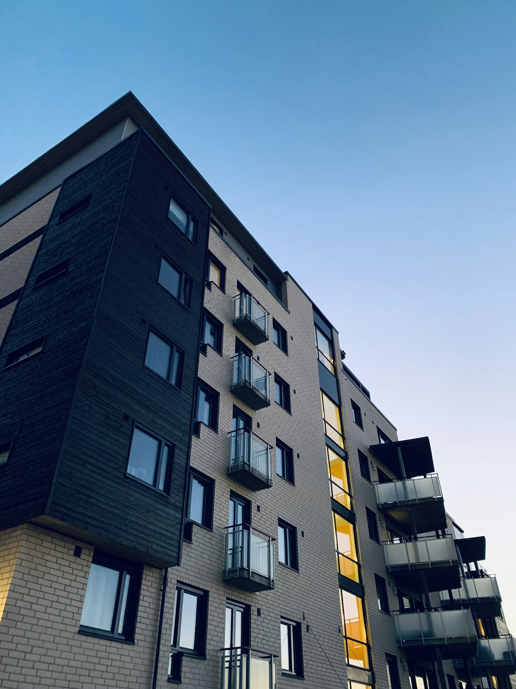

„Cigla ne propada." Čuo si to milion puta i deluje pametno. Ali pitaj nekoga ko stvarno izdaje stan da li mu se baš isplati — pa gledaj kako počinje da računa naglas, da se mršti i da se seća stanara koji mu je uništio parket.

Investiranje u nekretnine u Srbiji **može** da bude odlična odluka. Ali samo ako računaš pošteno, a ne na pamet i na osećaj. Ovaj vodič te vodi kroz sve što treba da znaš pre nego što daš desetine hiljada evra za stan: kako se računa stvarni prinos, koliki je porez, koje troškove skoro svi „zaborave", gde da kupiš i kada nekretnina jednostavno **nema** smisla.

Sedi, ovo je duže nego obično — jer je i odluka veća od obične.

## Zašto su nekretnine omiljena investicija u Srbiji

Kod nas je ljubav prema nekretninama skoro religiozna. Razloga ima nekoliko, i nisu glupi:

- **Opipljivo je.** Stan vidiš, dodirneš, uđeš u njega. Akcija je slovo na ekranu, a stan je stan.
- **Daje mesečni prihod.** Kirija stiže svakog meseca, što ljudima daje osećaj sigurnosti.
- **Štit od inflacije.** Kad dinar slabi, cene nekretnina i kirije obično prate, pa ti vrednost ne kopni kao para na računu.
- **Nasleđe.** Stan ostaje deci. Teško je „nasledniku" objasniti ETF, lako je dati ključeve.

Sve je to tačno. Ali nijedna od tih stvari ti ne govori **da li ti se konkretna kupovina isplati**. Za to treba da računaš. Hajde da računamo.

## Kako se računa stvarni prinos od izdavanja

Većina ljudi računa ovako:

> „Stan me košta 100.000 evra, izdajem ga za 450 evra mesečno. To je 5.400 evra godišnje — znači **5,4%** prinosa. Super!"

Greška. To je **bruto** prinos, prinos *pre* svih troškova i poreza. A pravi novac se vidi tek kad oduzmeš ono što odlazi.

Formula za bruto prinos je jednostavna:

**Bruto prinos = (mesečna kirija × 12) ÷ cena nekretnine × 100**

Ali tebe zanima **neto prinos** — ono što ti stvarno ostane u džepu:

**Neto prinos = (godišnja kirija − porez − svi troškovi − prazni meseci) ÷ ukupna investicija × 100**

I tu „5,4%" počinje da se topi.

## Troškovi koje skoro svi „zaborave"

Evo šta jede tvoj prinos, a retko ko ga ubroji unapred:

- **Porez na prihod od izdavanja.** Nije opcioni. Plaćaš ga na kiriju i moraš da ga prijaviš [Poreskoj upravi](https://www.purs.gov.rs/). Više o tome niže.
- **Prazni meseci.** Niko ti ne garantuje 12 izdatih meseci godišnje. Ako ti stan stoji prazan mesec-dva između stanara, to je direktan minus na prinos.
- **Održavanje i popravke.** Bojler, klima, šporet, krečenje, vodoinstalater. Stvari se kvare, a ti plaćaš.
- **Trošak ulaganja na početku.** Stan se retko izdaje „kakav jeste" — namештaj, beli tehnika, sređivanje. To su hiljade evra pre prve kirije.
- **Porez na prenos apsolutnih prava / PDV pri kupovini**, troškovi notara, uknjižbe, agencije.
- **Agencijska provizija** za pronalaženje stanara, ako to ne radiš sam.
- **Vreme i nervi.** Problematični stanari, kasne uplate, pozivi u 23h da je „nešto procurilo". To je posao, ne pasivni prihod iz reklama.

Kad sve to oduzmeš, onih „5,4%" se lako pretvori u **3 do 4 posto neto**. I dalje može biti sasvim dobro — ali sad bar znaš **pravu** brojku, a ne marketinšku.

## Konkretan primer: stan od 100.000 € u Beogradu

Da ne pričamo apstraktno. Zamisli realan scenario:

| Stavka | Iznos (godišnje) |
| --- | --- |
| Bruto kirija (450 € × 12) | 5.400 € |
| − Porez na izdavanje (procena) | ~600 € |
| − Prazan mesec (1 mesec) | −450 € |
| − Održavanje i sitne popravke | −400 € |
| − Osiguranje / rezerva | −150 € |
| **Neto godišnji prihod** | **~3.800 €** |

Na investiciju od 100.000 € (plus recimo 5.000 € početnog uređenja i troškova kupovine = 105.000 €), to je neto prinos od **oko 3,6%**.

Da li je to loše? Ne nužno — uz to ide i potencijalni rast vrednosti samog stana. Ali ako si ušao očekujući „pet i po posto pasivno", upravo si video zašto je iskreno računanje pola posla.

> Najskuplja rečenica u investiranju u nekretnine glasi: „Pa otprilike će biti oko pet posto." Otprilike i oko su reči koje te koštaju hiljade.

## Porez na izdavanje stana u Srbiji: ono što moraš da znaš

Poreza se mnogi plaše ili ga ignorišu — oba su greška. Suština:

- Prihod od izdavanja nepokretnosti **se oporezuje**. Plaćaš porez na prihod, uz zakonsko priznavanje normiranih troškova (deo kirije se priznaje kao trošak, pa se oporezuje umanjena osnovica).
- Ako izdaješ kao fizičko lice, postupak prijave i stopa se razlikuju od situacije kad izdaješ preko firme ili paušalno.
- Pravila i stope se **vremenom menjaju**. Zato u ovom tekstu ne navodim tačan procenat kao zakon uklesan u kamen — nego ti kažem: **pre kupovine proveri aktuelne propise** na sajtu Poreske uprave Republike Srbije ili kod knjigovođe.

Poenta nije da te uplašim porezom. Poenta je da ga **uračunaš u prinos pre kupovine**, a ne da se neprijatno iznenadiš posle.

## Lokacija, lokacija, lokacija — i dalje vlada

Stara izreka u nekretninama kaže da su tri najvažnije stvari lokacija, lokacija i lokacija. Banalno, ali tačno.

Dobar kraj znači:

- **Lakše izdavanje** — manje praznih meseci.
- **Stabilniji stanari** — ljudi koji mogu da plate dobar kraj obično plaćaju i na vreme.
- **Lakša preprodaja** — kad zatreba da unovčiš, dobar kraj se prodaje sam.

Na šta konkretno da gledaš kad biraš lokaciju za investiciju:

- **Blizina prevoza** (autobus, tramvaj, metro u budućnosti) i glavnih saobraćajnica.
- **Sadržaji u okolini** — prodavnice, škole, fakulteti, bolnice, kafići.
- **Ko traži stan u tom kraju** — studenti, mlade porodice, zaposleni? Od toga zavisi tip stana koji se najbolje izdaje.
- **Planovi razvoja** — nova linija prevoza, projekat, fakultet u blizini ume da podigne vrednost.

Jeftin stan u lošem kraju koji večito stoji prazan zna da bude **skuplja** greška od skupljeg stana u traženom kraju.

## Stan za izdavanje vs. kuća vs. poslovni prostor

Nije svaka nekretnina ista investicija:

- **Garsonjere i jednosobni stanovi** — najlikvidniji za izdavanje, najveća potražnja, obično najbolji procentualni prinos. Zato su omiljeni za investiciju.
- **Veći stanovi (dvosobni, trosobni)** — manji procentualni prinos, ali stabilniji, dugoročniji stanari (porodice).
- **Kuće** — više održavanja, sporije se izdaju i prodaju, ali mogu biti dobre za specifične lokacije.
- **Poslovni prostor** — viši prinosi, ali i veći rizik praznog prostora i zavisnost od privrede.

Za prvog investitora, mali stan u dobrom kraju je najčešće najpametniji početak.

## Kratkoročno (turistički) vs. dugoročno izdavanje

Airbnb i kratkoročno izdavanje deluju primamljivo zbog viših dnevnih cena. Ali budi realan:

- **Kratkoročno** može da donese više, ali traži mnogo više rada (čišćenje, smene gostiju, komunikacija), zavisi od turističke sezone i podložno je promenama propisa i pravila zgrade.
- **Dugoročno** donosi manje po mesecu, ali je mirnije, predvidivije i traži manje tvog vremena.

Ako tražiš nešto bliže „pasivnom" — dugoročno. Ako si spreman da to tretiraš kao mali biznis — kratkoročno može da se isplati, ali nije pasivno.

## Kada investiranje u nekretnine IMA smisla

- Kad imaš **ozbiljniji kapital** i nakon kupovine ti i dalje ostaje [rezerva za crne dane](/blog/hitna-rezerva-fond-za-crne-dane/).
- Kad ti taj novac **ne treba uskoro** — nekretnine nisu likvidne, ne prodaješ pola stana kad zagusti.
- Kad si spreman na **obaveze** izdavanja: stanare, popravke, papirologiju.
- Kad ti je nekretnina **deo** [diversifikovanog portfolija](/blog/diversifikacija-portfolija/), a ne sve što imaš.

## Kada NEMA smisla

- Kad bi za kupovinu morao da se **zadužiš preko glave** i ostaneš bez ikakve rezerve.
- Kad ti je stan **jedina** investicija — sva jaja u jednoj cigli je rizik isto kao sva jaja u jednoj akciji.
- Kad kupuješ „jer svi kupuju" i „jer cigla ne propada", bez ijednog izračunatog broja.
- Kad još nisi rešio osnove: ako imaš [skupe dugove](/blog/7-koraka-do-finansijske-slobode/) ili nemaš rezervu, nekretnina čeka.

## Najčešće greške pri kupovini investicione nekretnine

1. **Računanje samo bruto prinosa.** Već smo videli kako se „5%" istopi u 3,5%.
2. **Zanemarivanje poreza i troškova.** Najskuplja vrsta optimizma.
3. **Kupovina iz emocije.** „Sviđa mi se" je razlog za stan u kom živiš, ne za investiciju.
4. **Preplaćivanje.** Najbolja nekretnina je loša investicija ako je preplatiš — isto kao kod [vrednosnog investiranja u akcije](/blog/investiranje-po-vrednosti/).
5. **Sav novac u jednu nekretninu, bez rezerve.** Jedan veliki kvar i nemaš čime da ga platiš.
6. **Loša procena stanara.** Jedan problematičan stanar ti pojede prinos cele godine.

## Nekretnine ili akcije? Iskren odgovor

Ovo je večita dilema, i već smo je dotakli u tekstu [Akcije, nekretnine ili štednja](/blog/akcije-nekretnine-ili-stednja/). Ukratko:

- **Akcije/ETF-ovi**: dostupni sa malim novcem, likvidni, istorijski najveći dugoročni prinos, ali jače osciluju. Možeš da [kreneš iz Srbije lako](/blog/ulaganje-novca-u-akcije/).
- **Nekretnine**: opipljive, mesečni prihod, štit od inflacije, ali traže veliki kapital, nisu likvidne i nose troškove i rad.

Pametan odgovor skoro nikad nije „samo jedno". Većini ljudi ima smisla da **prvo grade kapital kroz redovno investiranje**, pa kad skupe ozbiljniju sumu, dodaju nekretninu kao stub stabilnosti — ne kao prvu i jedinu kocku.

## Zaključak: cigla jeste dobra, ali nije magična

Investiranje u nekretnine u Srbiji ostaje jedan od najsolidnijih načina da sačuvaš i uvećaš novac — pod uslovom da uđeš otvorenih očiju. To znači: računaj **neto, ne bruto**; uračunaj **porez i prazne mesece**; biraj **lokaciju** pre cene; i nikad ne ulaži poslednje pare koje imaš.

Cigla ne propada — ali loša računica propada uvek. Sad imaš sve da računaš kako treba.
