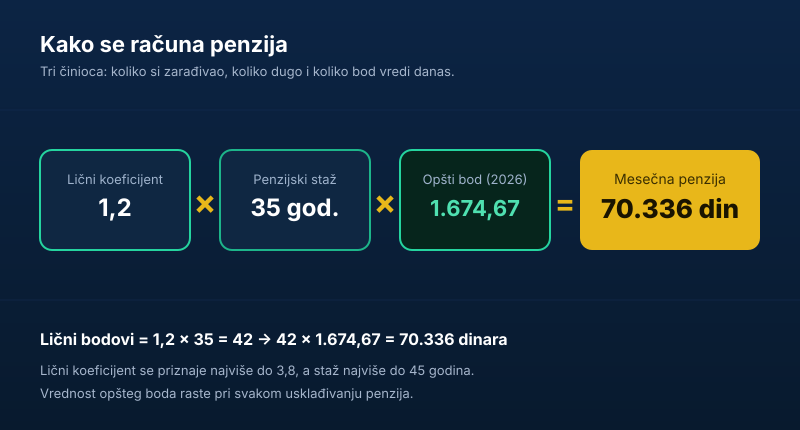

Penzija u Srbiji ne pada s neba i nije fiksan iznos koji država deli „od oka". Računa se po jasnoj formuli, a kada jednom razumeš njena tri sastojka, možeš sam da napraviš pristojnu procenu svojih budućih primanja — i da na vreme vidiš da li ti se isplati da radiš još koju godinu ili da kupiš staž.

Kratko i odmah, formula glasi:

> **Penzija = lični koeficijent × penzijski staž × vrednost opšteg boda**

Sve ostalo u ovom tekstu je objašnjenje šta je svaki od ta tri činioca, koliko iznose u 2026. godini i kako da ih spojiš u konkretan broj. Na kraju te čeka i nekoliko rešenih primera.

## Tri sastojka penzije

Formula ima tri dela, i svaki meri nešto drugo:

- **Lični koeficijent** — *koliko* si zarađivao u odnosu na ostale.
- **Penzijski staž** — *koliko dugo* si uplaćivao doprinose.
- **Opšti bod** — *koliko jedan „bod" vredi* u dinarima danas.

Prva dva broja zavise samo od tebe i tvoje radne istorije. Treći je državni „kurs" koji se menja sa svakim usklađivanjem penzija i jednak je za sve.

Tehnički, obračun ide u dva koraka. Prvo se lični koeficijent pomnoži stažom i dobiju se **lični bodovi**. Zatim se lični bodovi pomnože vrednošću opšteg boda i dobija se mesečna penzija u dinarima.

## 1. Lični koeficijent: koliko si zarađivao

Lični koeficijent pokazuje kako su tvoje zarade stajale u odnosu na republički prosek tokom celog radnog veka.

Računa se tako što se za svaku godinu rada tvoja godišnja zarada podeli prosečnom godišnjom zaradom u Srbiji za tu istu godinu. Dobiješ niz godišnjih odnosa, pa se oni usrednje. Logika je jednostavna:

- Ako si neke godine zaradio **tačno prosek**, odnos je **1,0**.
- Ako si zaradio **duplo više** od proseka, odnos je **2,0**.
- Ako si bio **ispod proseka**, odnos je manji od 1,0.

Zbog toga sistem nije nepravedan prema nekome ko je radio u doba visoke ili niske inflacije — ne gleda se nominalni dinar iz neke davne godine, nego tvoj *položaj u odnosu na prosek* te godine.

**Važno ograničenje:** lični koeficijent se priznaje najviše do **3,8**. I da si decenijama zarađivao pet ili deset proseka, u obračun penzije ulazi 3,8. To je gornja granica koja sprečava ekstremno visoke penzije.

## 2. Penzijski staž: koliko dugo si uplaćivao

Penzijski staž je ukupno vreme tokom kog su za tebe uplaćivani doprinosi za penzijsko i invalidsko osiguranje. U obračun ulazi decimalno — 35 godina i 6 meseci računa se kao 35,5.

U staž, pored „klasičnog" radnog odnosa, mogu da uđu i periodi kao što su vreme provedeno na bolovanju, porodiljsko odsustvo, ili period za koji je dokupljen (kupljen) staž. Postoji i **beneficirani staž**, gde se za teške i opasne poslove godina rada računa uvećano (npr. 12 ili 14 meseci za 12 odrađenih).

I ovde važi granica: u obračun ulazi **najviše 45 godina** staža. Ko napuni 45 godina staža, ispunio je uslov za penziju bez obzira na godine života.

## 3. Opšti bod: koliko bod vredi u dinarima (2026)

Opšti bod je vrednost koju država periodično određuje i koja tvoje lične bodove pretvara u dinare. To je svojevrstan „kurs" za penzije.

Od početka **2026. godine vrednost opšteg boda iznosi 1.674,67 dinara**. Do tog iznosa se došlo posle redovnog usklađivanja od **12,2%**, koje je primenjeno od decembra 2025. (pre usklađivanja iznosio je 1.551,45 dinara).

Ova vrednost nije zaleđena — raste pri svakom usklađivanju penzija, koje se sprovodi po takozvanoj **švajcarskoj formuli**: polovina rasta zavisi od inflacije, a polovina od rasta prosečnih zarada. Zato penzija koju izračunaš danas nije isto što ćeš primati za deset godina — i nominalni iznos i opšti bod se vremenom usklađuju.

## Konkretan primer obračuna

Spojimo sve u brojeve. Uzmimo radnika sa ličnim koeficijentom **1,2** (zarađivao malo iznad proseka) i **35 godina** staža, sa vrednošću opšteg boda za 2026.

| Korak | Računica | Rezultat |
|---|---|---|
| Lični bodovi | 1,2 × 35 | 42 boda |
| Mesečna penzija | 42 × 1.674,67 | **70.336 dinara** |

Drugi primer — radnik koji je ceo vek zarađivao tačno prosek (koeficijent **1,0**), ali sa dužim stažom od **40 godina**:

| Korak | Računica | Rezultat |
|---|---|---|
| Lični bodovi | 1,0 × 40 | 40 bodova |
| Mesečna penzija | 40 × 1.674,67 | **66.987 dinara** |

Vidi se poenta: i staž i visina zarade vuku penziju naviše, ali nijedno samo po sebi ne čini čuda. Onaj ko je zarađivao malo više, ali kraće radio, i onaj ko je bio na proseku ali duže — završavaju blizu jedan drugog.

Čisto radi orijentacije, **teorijski maksimum** je 3,8 × 45 = 171 bod, što daje oko 286.000 dinara — iznos koji u praksi dostiže tek šačica ljudi.

## Vrste penzija i uslovi u 2026.

Formula je ista, ali uslovi pod kojima se ide u penziju razlikuju se po vrsti.

**Starosna penzija (redovna):**

- Muškarci: **65 godina** života + najmanje 15 godina staža.
- Žene: **64 godine** života + najmanje 15 godina staža. Granica za žene raste po dva meseca godišnje, sve do 2032, kada će biti izjednačena sa muškarcima (65).
- Oba pola: **45 godina staža**, bez obzira na godine života.

**Prevremena starosna penzija:** za one koji žele ranije, uz uslov od **40 godina staža i 60 godina života**. Cena je trajno umanjenje: **0,34% za svaki mesec** ranijeg odlaska, najviše do **20,4%**. To umanjenje je doživotno — ne ukida se ni kada napuniš godine za redovnu penziju.

> Primer: ko ode u penziju dve godine ranije (24 meseca) ima trajno umanjenje od 24 × 0,34% = **8,16%**. Penzija od 67.000 dinara tako pada na oko 61.500 dinara — zauvek.

**Invalidska penzija:** za potpuni gubitak radne sposobnosti, pod posebnim uslovima koje utvrđuje lekarska komisija.

**Porodična penzija:** pravo članova porodice (supružnik, deca) posle smrti osiguranika ili korisnika penzije.

Detaljne uslove za odlazak u penziju — po polu i godini — razložili smo u posebnom vodiču: [uslovi za penziju u Srbiji 2026](/blog/uslovi-za-penziju-2026/).

## Najniža i najviša penzija

Bez obzira na to šta kaže formula, penzija ne može biti niža od zakonom zajemčenog minimuma. U 2026. **najniža penzija** za kategoriju zaposlenih i samostalnih delatnosti iznosi **31.092 dinara**, a za poljoprivrednike **24.443 dinara**. Radi poređenja, **prosečna penzija** u januaru 2026. bila je oko **56.843 dinara**.

Postoji i gornje ograničenje, koje proističe iz već pomenutog limita ličnog koeficijenta (3,8) i maksimalnog staža (45 godina).

## Kako da proveriš svoj staž i izračunaš penziju

Tvoja računica po formuli je odlična za orijentaciju, ali zvaničan je samo obračun PIO fonda. Pre nego što doneseš bilo kakvu odluku:

1. **Proveri svoj staž.** Stanje staža osiguranja možeš da vidiš preko portala Republičkog fonda [PIO](https://www.pio.rs/) ili preko [eUprave](https://euprava.gov.rs/). Greške u evidenciji (neprijavljeni periodi, neuplaćeni doprinosi) nisu retke i bolje ih je rešiti na vreme.
2. **Sredi nedostajuće periode** ako ih ima — kroz dokup staža ili regulisanje sa bivšim poslodavcem.
3. **Traži informativni obračun** u PIO fondu kada se približiš uslovima.

Ako tek planiraš finansije za penzionerske dane, korisno je da pogledaš i naše tekstove o tome kako da napraviš [hitnu rezervu](/blog/hitna-rezerva-fond-za-crne-dane/) i kako da [pametno upravljaš ličnim finansijama](/blog/kako-pametno-upravljati-finansijama/) — državna penzija je temelj, ali retko kad i cela priča.

## Najčešće greške u razmišljanju o penziji

- **„Visoka plata na kraju karijere znači visoku penziju."** Ne nužno — gleda se ceo radni vek, ne poslednjih nekoliko godina.
- **„Rad na crno se nekako podrazumeva."** Period bez uplaćenih doprinosa ne ulazi u staž. To su godine koje jednostavno nestaju iz obračuna.
- **„Idem ranije, kasnije će se to izravnati."** Umanjenje kod prevremene penzije je trajno i ne nestaje.
- **„Sve će izračunati država, ne moram da se mešam."** Hoće — ali na osnovu evidencije koja zna da bude nepotpuna. Provera je tvoja odgovornost.

## Zaključak

Visina penzije u Srbiji svodi se na tri broja: koliko si zarađivao (lični koeficijent, do 3,8), koliko dugo (penzijski staž, do 45 godina) i koliko bod vredi danas (opšti bod, 1.674,67 dinara u 2026). Pomnožiš ih i dobiješ pristojnu procenu. Ono što ne možeš da kontrolišeš — opšti bod i usklađivanja — isto je za sve; ono što možeš — staž i prijavljene zarade — vredi proveriti dok je vremena.

---

*Ovaj tekst je informativnog karaktera i ne predstavlja finansijski savet niti zvaničan obračun. Konačnu visinu penzije, kompletan staž i ispunjenost uslova utvrđuje isključivo Republički fond za penzijsko i invalidsko osiguranje (PIO). Iznosi navedeni za 2026. godinu podložni su promenama pri narednim usklađivanjima.*
