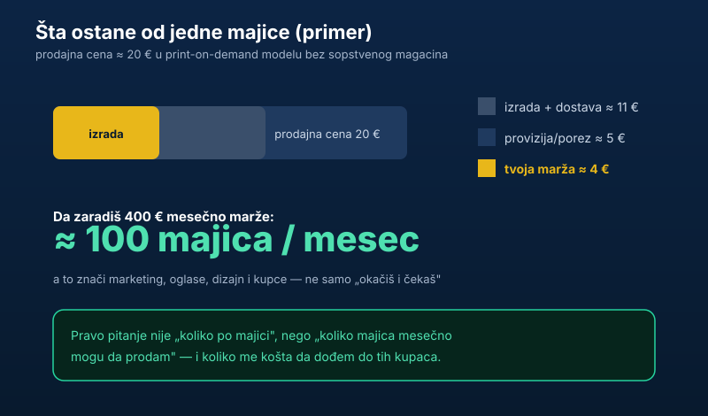

„Okačiš par dizajna, podeliš link i pare kapuju dok spavaš” — tako **biznis prodaje majica preko interneta** izgleda u rilsovima. Stvarnost je drugačija, ali ne i loša: ovo jeste legitiman način dodatne zarade, samo ako uđeš u njega kao u posao, sa brojkama, a ne kao u lutriju. Hajde trezveno, iz ugla novca. (Ako si dovde stigao tražeći laku zaradu na klik, prvo pročitaj [zašto zarada od klikova skoro nikad ne vredi truda](/blog/kako-funkcionise-zarada-od-klikova/) — pa se vrati.)

## Kako model uopšte funkcioniše

Najpristupačniji način danas je **print-on-demand (POD)**: ti postaviš dizajn, a platforma štampa majicu tek kad neko naruči, pa je šalje kupcu. Ti nemaš magacin, ne kupuješ zalihe unapred i ne pakuješ pošiljke. Zvuči idealno — i jeste, kad je reč o riziku zaliha. Ali ta udobnost ima cenu: pošto platforma radi štampu i dostavu, njoj ide najveći deo cene, a tebi ostaje tanka marža.

## Računica po jednoj majici

Evo zašto je marža srce celog posla. Uzmimo majicu koju prodaješ za oko 20 evra:

- **Izrada i dostava:** ~11 evra ide platformi za štampu i slanje.
- **Provizija i porez:** ~5 evra na naknade kanala i dažbine.
- **Tvoja marža:** ~4 evra po komadu.

Sad prebaci to u cilj. Hoćeš 400 evra mesečno čiste marže? To je **oko 100 prodatih majica mesečno**. A svaka od tih 100 prodaja traži da te kupac pronađe — kroz oglase, sadržaj ili publiku koju već imaš. Tu nastaje pravi trošak i pravi posao.

## Najveća greška početnika

Skoro svi krenu od pogrešnog pitanja: „kako da napravim majicu”. To je lak deo. Težak deo je: **kako da dođem do kupaca i po kojoj ceni**.

Ako za svaku prodaju potrošiš na oglase koliko i zaradiš marže, vrtiš se u krug. Zato pre skaliranja moraš da znaš dve brojke:

- **Koliko te košta jedan kupac** (trošak oglasa po prodaji).
- **Koliko ti ostane po majici** (marža).

Ako je marža veća od troška sticanja kupca — imaš biznis. Ako nije — imaš skup hobi. Ova logika „prati brojke, pa tek onda ubrzaj” ista je kao u ozbiljnom ulaganju; o tome zašto se ne ulazi naslepo piše [investiranje nije kockanje](/blog/investiranje-nije-kockanje/).

## Niša je sve

Najčešća razlika između prodavnice koja radi i one koja ćuti nije dizajn nego **niša**. „Majice za svakoga” se ne prodaju jer ih je nemoguće targetirati. „Majice za odbojkaše”, „za vlasnike francuskih buldoga”, „za programere” — to su publike kojima tačno znaš da se obratiš i jeftinije dođeš do njih. Uska, jasna publika gotovo uvek pobeđuje široku.

## Porez i registracija u Srbiji

Čim od ovoga počneš da ostvaruješ redovan prihod, ulaziš u zonu u kojoj te zanima i pravna strana. U Srbiji se najčešće kreće kroz registraciju **preduzetnika**, a mnogi počnu kao **paušalno oporezovani** dok je godišnji promet ispod zakonskog limita (paušal je vezan za prag prometa; iznad njega prelaziš u knjige). Ne ulazi u to napamet:

- Proveri aktuelna pravila i pragove kod [Poreske uprave](https://www.purs.gov.rs) i registraciju kod [APR-a](https://www.apr.gov.rs).
- Posavetuj se sa knjigovođom oko statusa, mesečnih obaveza i toga šta smeš da odbiješ kao trošak.
- Ako prodaješ u inostranstvo preko POD platforme, raspitaj se i o tome kako se tretira prihod iz inostranstva.

> **Napomena:** ovaj tekst je informativnog karaktera i ne predstavlja poreski ni pravni savet. Za konkretan status i obaveze obrati se knjigovođi i nadležnim institucijama.

## Da li se isplati?

Može da se isplati — ali ne kao „pasivni” novac iz reklama, nego kao mali biznis koji traži dizajn, marketing i praćenje brojki. Ako te to privlači, kreni malo, testiraj nišu i meri maržu naspram troška kupca pre nego što uložiš ozbiljnije.

A ono što zaradiš nemoj da ostane da stoji. Bilo da je reč o majicama ili bilo kom dodatnom prihodu, sledeći korak je da taj novac usmeriš — prvo u red u budžetu, pa u ulaganje. Šira slika kako od dodatne zarade napraviti imovinu je u tekstu [7 koraka do finansijske slobode](/blog/7-koraka-do-finansijske-slobode/), a pregled gde taj novac da uložiš u [gde uložiti novac u Srbiji](/blog/gde-uloziti-novac/).
