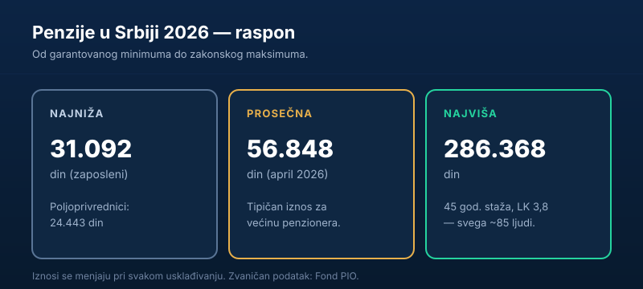

„Kolika je najmanja, a kolika najveća penzija?" — pitanje koje se vraća svaki put kada se priča o usklađivanju. Razlika je ogromna: od garantovanog minimuma do iznosa koji prima tek šačica ljudi. U nastavku donosimo **aktuelne iznose za 2026**, uz objašnjenje kako se te granice uopšte određuju.

Kratko, za one kojima treba odmah:

> U 2026. **najniža** penzija (zaposleni) iznosi oko **31.092 dinara**, **prosečna** oko **56.848 dinara**, a **najviša** oko **286.368 dinara**. Najviši iznos prima svega ~85 ljudi u celoj Srbiji.

## Kolika je najniža penzija u 2026.

Najniži iznos penzije je **socijalna zaštita** — granica ispod koje redovna penzija ne može da padne, čak i kada bi izračunata penzija po formuli bila manja. U 2026. najniži iznosi su:

| Kategorija | Najniži iznos (približno) |
|---|---|
| Zaposleni i samostalne delatnosti | 31.092 din |
| Poljoprivrednici | 24.443 din |

Ovaj iznos nije isto što i socijalna pomoć — reč je o penziji osiguranika koji su ispunili uslove, ali im je izračunata penzija veoma niska (npr. zbog niskih zarada ili kraćeg staža).

## Kolika je najviša penzija

Na drugom kraju je **najviši iznos**, oko **286.368 dinara**. Da bi se on dostigao, moraju se poklopiti dva maksimuma:

- **lični koeficijent 3,8** (zakonski maksimum — znači, ceo radni vek zarađivati blizu 3,8 puta više od proseka), i
- **45 godina staža**.

Takvih ljudi je veoma malo — procena je da maksimalnu penziju prima **oko 85 korisnika** u celoj Srbiji. Za većinu, dakle, najviša penzija je teorijska gornja granica, a ne realnost.

## Prosečna penzija — gde je većina

Najkorisniji broj za osećaj realnosti je **prosečna penzija**, koja u 2026. iznosi oko **56.848 dinara**. Bitno je primetiti da je prosek mnogo bliži **najnižoj** nego najvišoj penziji — što znači da veliki broj korisnika prima iznose oko proseka ili ispod njega.

Zato slika „od 31 do 286 hiljada" može da zavara: realan život ogromne većine penzionera odvija se u donjoj trećini tog raspona.

> Za one sa najnižim primanjima, država povremeno uvodi i **dodatnu novčanu pomoć**. Tako je uredbom s kraja 2025. predviđena pomoć za korisnike čija je penzija do oko **73.734 dinara**, za period decembar 2025 — novembar 2026.

## Kako se te granice menjaju

Ni najniža ni najviša penzija nisu zaleđene. Obe se menjaju pri svakom **[usklađivanju penzija](/blog/uskladjivanje-penzija/)** po švajcarskoj formuli — kada rastu sve penzije, rastu i granice raspona. Zato iznose iz ovog teksta treba čitati kao **aktuelne za 2026** i proveriti ih posle narednog usklađivanja.

Ako te zanima zašto baš toliko, a ne više ili manje — sve se vraća na tri ulazna broja iz formule: lični koeficijent, staž i vrednost opšteg boda. Detaljno smo to razložili u vodiču [kako se računa penzija u Srbiji](/blog/kako-se-racuna-penzija-u-srbiji/).

## Najniža penzija nije socijalna pomoć

Važno je razdvojiti dva pojma koja ljudi često mešaju:

- **Najniži iznos penzije** je penzija — pravo onoga ko je **ispunio uslove** (godine, staž), ali mu je izračunata penzija po formuli veoma niska, pa je država podiže do zajemčenog minimuma.
- **Socijalna (novčana) pomoć** je davanje za one koji **nemaju penziju** niti ispunjavaju uslove.

Drugim rečima, najnižu penziju prima neko ko je ceo radni vek bio osiguran, ali je zarađivao malo ili imao kraći staž. To nije milostinja, već donji prag sistema. Zato i raste pri svakom usklađivanju, kao i ostale penzije.

## Zašto „prosek" ume da prevari

Prosečna penzija od ~56.848 dinara zvuči pristojno, ali prosek ima poznatu manu: **povlače ga naviše visoke penzije**. Mali broj ljudi sa penzijama od 150.000, 200.000 ili 286.000 dinara podiže prosek iznad onoga što prima tipičan penzioner.

Realniju sliku daje **medijana** — iznos ispod kog i iznad kog je tačno pola penzionera. Ona je po pravilu **niža od proseka**, što znači da više od polovine penzionera prima manje od prosečne penzije. Zato, kada čuješ „prosečna penzija je skoro 57 hiljada", imaj na umu da je realnost većine bliža donjoj polovini raspona.

## Od čega zavisi gde ćeš ti biti u rasponu

Tvoja penzija nije ni najniža ni najviša „slučajno" — određuju je tri ulazna broja iz formule:

- **lični koeficijent** — koliko si zarađivao u odnosu na prosek (maksimum 3,8),
- **penzijski staž** — koliko dugo si uplaćivao doprinose (maksimum 45 godina),
- **vrednost opšteg boda** — državni „kurs" koji je isti za sve.

Prva dva broja zavise od tebe i tvoje radne istorije, i upravo zato ima smisla [proveriti svoj staž](/blog/penzijski-staz/) i prijavljene zarade na vreme. Ko je duže radio i imao uredno prijavljene veće zarade, prirodno završava bliže gornjem delu raspona; ko je radio kraće ili „na crno", bliže donjem. Kako se ta tri broja množe u konačan iznos, korak po korak smo objasnili u vodiču [kako se računa penzija](/blog/kako-se-racuna-penzija-u-srbiji/).

## Najniža penzija nije isto što i zajemčena za sve

Čest nesporazum je da „najniža penzija" znači da svako ko ode u penziju dobija bar taj iznos. Nije tako. Najniži iznos je **donji prag za one koji su ispunili uslove**, ali im je penzija po formuli ispala niska. Ko nije ispunio uslove (nema dovoljno staža), ne ostvaruje pravo na penziju — pa ni na taj minimum.

Takođe, najniži iznos se razlikuje po **kategorijama osiguranika**: zaposleni i samostalne delatnosti imaju jedan prag (oko 31.092 din), a poljoprivrednici niži (oko 24.443 din). Pored same penzije, najstariji korisnici sa malim primanjima mogu da ostvare i druga davanja (npr. dodatak za pomoć i negu, ili povremenu novčanu pomoć), koja se računaju odvojeno od penzije i ne ulaze u sam iznos penzije.

## Zaključak

U 2026. raspon penzija u Srbiji ide od oko **31.092 dinara** (najniža, zaposleni) do oko **286.368 dinara** (najviša), uz prosek od oko **56.848 dinara**. Najviši iznos je redak izuzetak koji prima tek nekoliko desetina ljudi, dok se stvarnost većine vrti oko proseka. Pošto se sve tri vrednosti menjaju pri usklađivanju, najpouzdaniji, zvaničan podatak uvek potraži na sajtu [Fonda PIO](https://www.pio.rs/).

---

*Ovaj tekst je informativnog karaktera i ne predstavlja finansijski savet. Aktuelne iznose najniže, prosečne i najviše penzije, kao i uslove za dodatnu pomoć, utvrđuje i objavljuje isključivo Republički fond za penzijsko i invalidsko osiguranje (PIO). Iznosi se menjaju pri svakom usklađivanju.*
