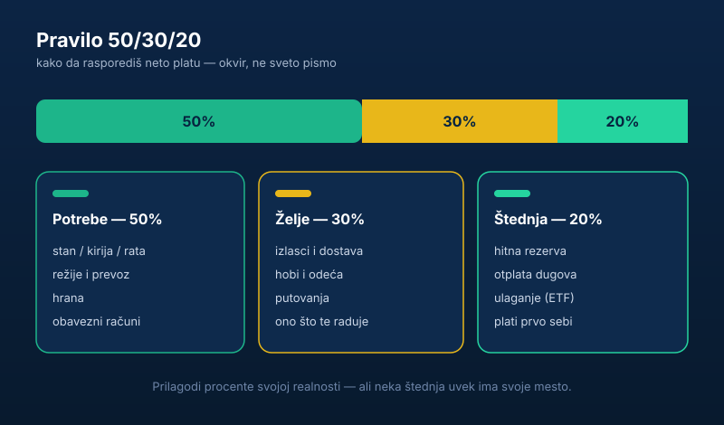

Reci mi koliko si potrošio na kafu, dostavu i sitnice prošlog meseca. Ne znaš? E pa to je tačno problem.

Većina ljudi tačno zna koliko zarađuje, a pojma nema kuda im pare odlaze. A onda se na kraju meseca pitaju „gde mi nestade plata". Nije nestala. Ti si je potrošio — samo nisi gledao. Ovaj vodič ti pokazuje **kako da napraviš kućni budžet za 30 minuta** i konačno preuzmeš kontrolu.

## Budžet nije kazna, budžet je sloboda

Ljudi misle da je budžet nešto što te ograničava. Pogrešno. Budžet je suprotno — to je trenutak kad **ti** kažeš svojim parama gde da idu, umesto da se na kraju meseca pitaš gde su otišle.

Bez budžeta, ti ne upravljaš parama. Pare upravljaju tobom. A bez plana, kao što volimo da kažemo: pare ne vole nadu, pare vole plan.

## Kako da napraviš budžet za 30 minuta

Nije raketna nauka. Treba ti papir, tabela ili neka aplikacija — svejedno. Najbolji alat je onaj koji ćeš zaista otvoriti i drugi mesec.

1. **Napiši koliko ti tačno ulazi.** Neto plata, honorari, sve. Ako prihod varira, uzmi prosek poslednjih meseci.
2. **Napiši sve fiksne troškove.** Kirija ili rata, režije, telefon, internet, prevoz, krediti, pretplate.
3. **Napiši promenljive troškove.** Hrana, izlasci, odeća, sitnice, dostava. Ovde se obično krije curenje.
4. **Oduzmi troškove od prihoda.** Ono što ostane — to je tvoj prostor.

Ako ti je rezultat negativan, ne paniči — sad bar **znaš**. A znanje je prvi korak. Najveći deo posla je već u tome što si prvi put video brojke na jednom mestu.

## Pravilo koje radi: 50/30/20

Ako ti treba jednostavan okvir, evo ga:

- **50%** na potrebe (stan, hrana, režije, prevoz)
- **30%** na želje (izlasci, hobi, ono što te raduje)
- **20%** na štednju i otplatu dugova

Nije sveto pismo, prilagodi ga sebi. U Srbiji, gde kirije i režije znaju da pojedu mnogo veći deo plate, „potrebe" će kod mnogih biti i preko 50% — to je u redu, samo neka štednja zadrži svoje mesto, makar bila i 5%. Ali ako trošiš 70% na „želje" a štediš 0% — e tu imamo problem koji nije u plati, nego u glavi.

## Plati prvo sebi

Najveća greška u redosledu: ljudi troše prvo, pa štede ono što ostane. A ne ostane ništa.

Okreni to. Čim ti uđe plata, **prvo odvoji štednju** — idealno automatskim trajnim nalogom koji svaki mesec prebaci dogovoreni iznos na poseban račun. Tako štednja prestaje da zavisi od tvoje volje na kraju meseca. Prvih par stotina evra koje tako sakupiš ima jasan zadatak — to je tvoja [rezerva za crne dane](/blog/hitna-rezerva-fond-za-crne-dane/), temelj na kom stoji sve ostalo.

Kad rezerva stoji, sledeći korak je da taj novac ne kopni na računu nego da radi — o tome zašto je to važno pišemo u tekstu [zašto je investiranje bitno](/blog/zasto-je-investiranje-bitno/).

## Najveća laž koju sebi govoriš

„Nemam od čega da štedim."

Da budemo iskreni: u 90% slučajeva to nije istina. Imaš od čega, samo nisi spreman da se odrekneš nečega. A to je tvoj izbor — samo budi pošten i nazovi ga pravim imenom. Mesec dana beleži baš svaki trošak i skoro uvek se pojavi prostor za koji nisi ni znao.

Ako želiš dublje da razvijaš zdrav odnos sa novcem i naviku štednje, pročitaj i [kako da konačno počneš da štediš i ne odustaneš](/blog/kako-pametno-upravljati-finansijama/), a budžet je i prvi od [7 koraka do finansijske slobode](/blog/7-koraka-do-finansijske-slobode/).

A ako budžet pokaže da problem stvarno nije curenje nego premali prihod, vredi pogledati i konkretne načine dodatne zarade — od [biznisa prodaje majica preko interneta](/blog/kako-zapoceti-biznis-prodaje-majica-preko-interneta/) do trezvenog pregleda [šta je realno, a šta prazna priča kod zarade preko interneta](/blog/kako-funkcionise-zarada-od-klikova/).

## Suština

Budžet nije tabela — budžet je odluka da prestaneš da pogađaš i počneš da znaš. Napravi ga ove nedelje, ne sledeće. Jer dok ne vidiš brojke crno na belo, sve ostalo je samo priča.

Trideset minuta danas vredi više od svake „dobre namere" da ćeš „od sledećeg meseca paziti". Sledeći mesec nikad ne dođe. Tabela dođe — čim je otvoriš.
