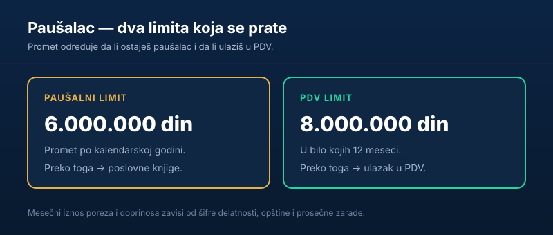

Za frilensere, programere, zanatlije i mnoge male preduzetnike u Srbiji, **paušalno oporezivanje** je najjednostavniji način da posluju legalno. Umesto knjigovodstva i obračuna stvarnog prihoda — fiksni mesečni iznos po rešenju. U ovom vodiču objašnjavamo ko može da bude paušalac u 2026, kako se određuje koliko plaća i gde su granice.

Kratko, za one kojima treba odmah:

> **Paušalac** plaća **fiksan mesečni** porez i doprinose po rešenju Poreske uprave, bez vođenja poslovnih knjiga. Limit je **6.000.000 dinara** prometa godišnje; poseban **PDV limit** je **8.000.000 dinara** u 12 meseci.

## Šta je paušalno oporezivanje

**Paušalno oporezivanje** je pojednostavljen poreski režim za preduzetnike. Umesto da se porez računa na osnovu stvarnog prihoda i rashoda iz poslovnih knjiga, država **unapred** određuje iznos poreza i doprinosa — rešenjem Poreske uprave.

Paušalac zato:

- **ne vodi** klasično knjigovodstvo (samo knjigu ostvarenog prometa — KPO),
- plaća **fiksan mesečni iznos**, predvidiv i isti bez obzira na to da li je mesec bio jak ili slab,
- ima **najmanji administrativni teret** od svih oblika preduzetništva.

Upravo zato je paušal omiljen među frilenserima i onima koji [zarađuju preko interneta](/blog/kako-funkcionise-zarada-od-klikova/).

## Ko može da bude paušalac

Da bi neko bio paušalno oporezovan, mora da ispuni dva osnovna uslova:

1. **Promet ispod limita** — najviše **6.000.000 dinara** u kalendarskoj godini.
2. **Dozvoljena delatnost** — da delatnost nije zakonom isključena iz paušala.

Zakon o porezu na dohodak građana izričito **isključuje** neke delatnosti iz paušala — na primer, oblast **reklamiranja i istraživanja tržišta**, a pod određenim uslovima i trgovinu, ugostiteljstvo i slično. Da li baš tvoja šifra delatnosti može u paušal, potvrđuje Poreska uprava rešenjem.

## Kako se određuje koliko plaćaš

Ovo je deo koji najviše zbunjuje: **ne postoji jedinstven iznos**. Mesečni porez i doprinosi se određuju **paušalno**, a na visinu utiču:

- **šifra delatnosti** (koliko se „rizično/profitabilno" tretira),
- **opština sedišta** (lokacija),
- **prosečna zarada** u toj sredini,
- **koeficijent delatnosti** propisan uredbom.

Zbog toga dva paušalca sa istom delatnošću, ali u različitim gradovima, mogu da plaćaju različite iznose. Konačan mesečni iznos uvek piše u **rešenju** koje izdaje [Poreska uprava](https://www.purs.gov.rs/).

## Dva limita koja se prate

Najčešća greška novih preduzetnika je mešanje dva različita praga:

| Limit | Iznos | Šta znači prelazak |
|---|---|---|
| Paušalni limit | 6.000.000 din / kalendarska godina | Gubitak prava na paušal → poslovne knjige |
| PDV limit | 8.000.000 din / bilo kojih 12 meseci | Ulazak u sistem PDV-a |

To su **dva odvojena praga**. Možeš ostati paušalac, a već ući u PDV — i obrnuto, dok ne pređeš 6 miliona ostaješ paušalac iako ti se promet približava osmici. Vredi pratiti oba broja tokom godine.

## Prednosti i mane

**Prednosti:**

- **jednostavnost** — nema obračuna stvarnog prihoda i rashoda,
- **predvidivost** — fiksan mesečni trošak, lak za [budžetiranje](/blog/novac-i-budzet/),
- **nizak administrativni teret** — manje papirologije i troškova knjigovodstva.

**Mane:**

- **limit prometa** — paušal ne raste sa biznisom; preko 6 miliona se mora na knjige,
- **plaćaš bez obzira na zaradu** — i u slabom mesecu ide isti iznos,
- **nije za svaku delatnost** — neke su isključene.

## Paušalac ili „frilenserski model"?

Ako radiš za inostrane ili domaće klijente, postoje **dva različita puta** da to legalizuješ — i lako se mešaju:

- **Paušalna radnja (preduzetnik paušalac)** — otvoriš radnju, dobiješ fiksni mesečni iznos i možeš da izdaješ fakture. Pogodno za one koji rade kontinuirano i fakturišu klijentima.
- **Frilenserski model oporezivanja** — namenjen fizičkim licima koja povremeno primaju prihod iz inostranstva, bez otvaranja radnje. Tu se porez plaća **kvartalno**, biranjem između dva modela: jedan sa fiksnim normiranim troškom i stopom 20%, drugi sa nižom stopom (10%) ali manjim normiranim troškom uvećanim za procenat prihoda.

Gruba logika: ko ima **stalan, veći** priliv i fakturiše — često mu se isplati **paušal**. Ko prima **povremeno i manje** — može mu odgovarati **frilenserski model** bez radnje. Pošto se dinarski iznosi i pragovi menjaju (poslednje izmene frilenserskih normiranih troškova stupile su na snagu početkom 2026), tačnu računicu za svoj slučaj proveri sa knjigovođom.

## Obaveze paušalca tokom godine

„Nema knjigovodstva" ne znači „nema obaveza". Paušalac i dalje mora da:

- **vodi knjigu prometa (KPO)** — evidenciju ostvarenog prihoda,
- **prati promet** u odnosu na limite od 6 i 8 miliona dinara,
- **plaća mesečne iznose** po rešenju, na vreme,
- **izdaje uredne fakture** klijentima.

Najveći rizik nije sam porez, nego **prekoračenje limita** koje se primeti prekasno — jer onda retroaktivno padaš na vođenje poslovnih knjiga ili u PDV sistem. Zato je praćenje prometa tokom godine, a ne tek na kraju, ključna navika svakog paušalca. Ko tek planira da krene, korisno je da prvo razdvoji [šta je realno, a šta prazna priča kod zarade preko interneta](/blog/kako-funkcionise-zarada-od-klikova/).

## Kako se registrovati

Ukratko, put do paušalca ide preko **Agencije za privredne registre (APR)**, gde se osniva preduzetnička radnja, uz opredeljenje za paušalno oporezivanje. Po registraciji, **Poreska uprava** izdaje rešenje sa mesečnim iznosom. Ako razmišljaš o pokretanju posla, pogledaj i konkretan primer računice u tekstu [kako započeti biznis prodaje majica preko interneta](/blog/kako-zapoceti-biznis-prodaje-majica-preko-interneta/).

## Zaključak

Paušalno oporezivanje je najjednostavniji režim za male preduzetnike i frilensere u Srbiji: **fiksan mesečni iznos** po rešenju Poreske uprave, bez knjigovodstva stvarnog prihoda. Granice su **6.000.000 dinara** prometa za sam paušal i **8.000.000 dinara** za ulazak u PDV. Pošto iznos zavisi od delatnosti, opštine i koeficijenata — a propisi se menjaju — pre registracije proveri aktuelne uslove kod [Poreske uprave](https://www.purs.gov.rs/) ili sa knjigovođom.

---

*Ovaj tekst je informativnog karaktera i ne predstavlja poreski ni pravni savet. Pravo na paušalno oporezivanje, mesečni iznos poreza i doprinosa, limite i isključene delatnosti utvrđuje i objavljuje Poreska uprava Republike Srbije. Pre odluka proveri aktuelne propise ili se posavetuj sa knjigovođom.*
