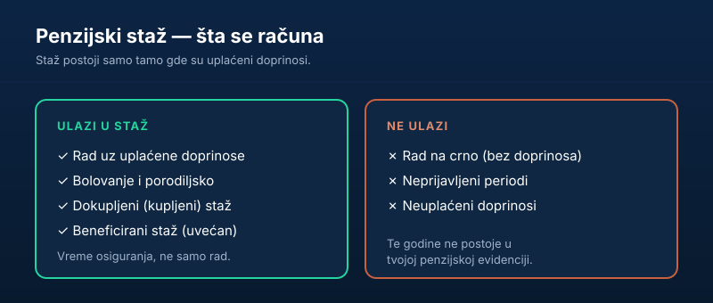

Kada se priča o penziji, sve se vrti oko jedne reči — **staž**. Ali šta tačno znači „imati staž" i šta sve u njega ulazi? Mnogi su iznenađeni kada otkriju da neke godine rada ne postoje u evidenciji, ili da im rad na teškim poslovima vredi više. U ovom vodiču razjašnjavamo šta se računa u **penzijski staž** i kako da proveriš svoj.

Kratko, za one kojima treba odmah:

> U penzijski staž ulazi **vreme za koje su uplaćeni doprinosi** — rad, bolovanje, porodiljsko, dokupljeni i beneficirani staž. **Rad na crno ne ulazi.** Staž proveravaš preko PIO fonda ili eUprave.

## Šta je penzijski staž

Penzijski staž je **ukupno vreme za koje si bio osiguran** i za koje su uplaćeni doprinosi za penzijsko osiguranje. On je jedan od tri ključna broja u obračunu penzije — pomnožen sa ličnim koeficijentom i vrednošću opšteg boda daje iznos penzije (više o tome u vodiču [kako se računa penzija](/blog/kako-se-racuna-penzija-u-srbiji/)).

Bitno je razdvojiti dva slična pojma:

- **Radni staž** — vreme provedeno u radnom odnosu.
- **Staž osiguranja** — širi pojam: svako vreme za koje je uplaćeno osiguranje, i kroz radni odnos i van njega (preduzetništvo, ugovori, dokup…).

Za penziju je merodavan **staž osiguranja**.

## Šta ulazi u staž

U penzijski staž, pored „klasičnog" rada, ulaze i:

- **rad uz uplaćene doprinose** — bilo kroz radni odnos, bilo kao preduzetnik/paušalac,
- **bolovanje** i **porodiljsko odsustvo**,
- **dokupljeni (kupljeni) staž** — period za koji si sam uplatio doprinose (vidi [kupovinu staža](/blog/kupovina-radnog-staza/)),
- **beneficirani staž** — staž na teškim poslovima, koji se računa uvećano.

Zajednički imenitelj svih ovih perioda je isti: **uplaćeni doprinosi**. Tu je i pravilo koje vredi zapamtiti — u staž se računa vreme osiguranja, a ne nužno vreme „provedeno na poslu".

## Beneficirani staž — kada godina vredi više

**Beneficirani staž** je posebna kategorija za naročito teške ili opasne poslove (npr. rudarstvo, određeni poslovi u industriji, neke službe). Kod njega se **vreme rada računa uvećano** — na primer, 12 meseci rada može da vredi kao 14, 15 ili 16 meseci staža, zavisno od stepena uvećanja propisanog za to radno mesto.

Posledica je važna: zaposleni na takvim poslovima **ranije ispunjavaju uslove** za penziju, jer im staž „teče brže". Ako si radio na poslu sa beneficijom, proveri da li je to ispravno evidentirano — jer direktno utiče na to kada možeš u penziju.

## Šta NE ulazi u staž

Najveća zabluda je da svaki rad „nešto donosi". Ne donosi. U staž **ne ulazi**:

- **rad na crno** — period rada bez prijave i bez uplaćenih doprinosa,
- **neprijavljeni periodi** kod poslodavca koji nije izmirio obaveze,
- svako vreme za koje, iz bilo kog razloga, **doprinosi nisu uplaćeni**.

Te godine, koliko god ih realno odradio, **ne postoje** u tvojoj penzijskoj evidenciji. Zato je provera na vreme toliko važna.

## Kako se staž dokazuje

Da bi neki period ušao u penziju, ne mora samo da postoji — mora i da bude **evidentiran**. Staž se dokazuje kroz:

- **prijave na osiguranje** (M obrasci) koje poslodavac podnosi pri zasnivanju i prestanku radnog odnosa,
- **uplate doprinosa** vidljive u matičnoj evidenciji Fonda,
- starija dokumenta poput **radne knjižice**, koja danas više nije obavezna, ali zna da posluži za periode iz prošlosti.

Problem se javlja kada postoji raskorak: radio si, ali prijava ili uplata nedostaje. Tada teret „popunjavanja rupe" pada na tebe — kroz regulisanje sa poslodavcem ili, gde je moguće, [dokup staža](/blog/kupovina-radnog-staza/). Što ranije uočiš nedostatak, veće su šanse da poslodavac još postoji i da se stvar reši bez komplikacija.

## Staž ostvaren u inostranstvu

Ako si radio u inostranstvu, taj staž ne propada automatski. Srbija ima **međudržavne sporazume o socijalnom osiguranju** sa velikim brojem zemalja, koji omogućavaju da se staž iz inostranstva **uzme u obzir** pri ostvarivanju prava na penziju.

U praksi to znači da se periodi rada u dve (ili više) zemalja mogu **sabirati** za ispunjenje uslova, a svaka zemlja potom isplaćuje svoj deo penzije srazmerno stažu ostvarenom kod nje. Pravila zavise od konkretnog sporazuma, pa ako imaš inostrani staž, obavezno to napomeni Fondu PIO pri podnošenju zahteva — jer se taj deo ne povlači sam od sebe.

## Kako da proveriš svoj staž

Ne čekaj penziju da bi prvi put pogledao svoj staž. Uradi to ranije:

1. **Proveri stanje** preko portala [Fonda PIO](https://www.pio.rs/) ili preko [eUprave](https://euprava.gov.rs/).
2. **Uporedi** evidentirane periode sa svojom radnom istorijom — greške i „rupe" nisu retke.
3. **Reši nedostajuće periode** na vreme: regulisanjem sa bivšim poslodavcem ili, gde je moguće, [dokupom staža](/blog/kupovina-radnog-staza/).

Što ranije uočiš problem, lakše ga je ispraviti — naročito ako poslodavac još postoji.

## Zaključak

Penzijski staž je vreme za koje su **uplaćeni doprinosi** — i tu spadaju rad, bolovanje, porodiljsko, dokupljeni i beneficirani staž, dok rad na crno ne donosi ništa. Pošto baš staž (uz lični koeficijent i opšti bod) određuje visinu penzije i to kada možeš da je ostvariš, najpametnije je da svoju evidenciju proveriš **na vreme** kod Fonda PIO. Ako otkriješ da ti nešto fali, sledeći korak je [uslovi za penziju 2026](/blog/uslovi-za-penziju-2026/) i, po potrebi, [kupovina staža](/blog/kupovina-radnog-staza/).

---

*Ovaj tekst je informativnog karaktera i ne predstavlja pravni ni finansijski savet. Tačno stanje staža, vrste staža i ispunjenost uslova utvrđuje isključivo Republički fond za penzijsko i invalidsko osiguranje (PIO). Pre odluka vezanih za penziju proveri svoju evidenciju kod nadležnog Fonda.*
