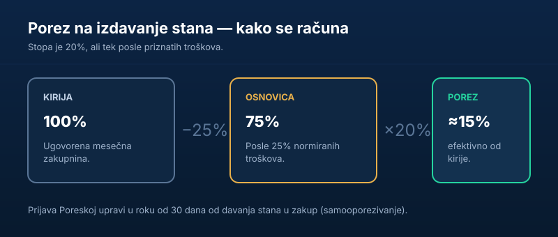

Izdavanje stana je za mnoge u Srbiji glavni ili dodatni prihod — ali uz njega ide i poreska obaveza koju dosta ljudi previdi. Dobra vest je da je obračun jednostavniji nego što deluje. U ovom vodiču objašnjavamo **koliki je porez na izdavanje stana**, kako se priznaju troškovi i kako se prijava podnosi.

Kratko, za one kojima treba odmah:

> Stopa je **20%**, ali se prvo prizna **25% normiranih troškova**, pa je efektivni porez oko **15% od kirije**. Prijava se podnosi **Poreskoj upravi u roku od 30 dana** od davanja stana u zakup.

## Koliki je porez na izdavanje

Porez na prihod od nepokretnosti obračunava se u dva koraka:

1. od ugovorene kirije oduzme se **25% normiranih troškova**, pa ostaje **75%** kao poreska osnovica,
2. na tu osnovicu primeni se stopa od **20%**.

Kombinacija to dvoje daje **efektivnih oko 15%** od ugovorene zakupnine. To je iznos koji realno ide državi.

| Stavka | Vrednost |
|---|---|
| Ugovorena kirija | 100% |
| Normirani troškovi | −25% |
| Poreska osnovica | 75% |
| Stopa poreza | 20% |
| **Efektivni porez** | **≈ 15% kirije** |

## Normirani troškovi — umanjenje bez dokazivanja

Ideja **normiranih troškova** je jednostavna: vlasnik stana ima neke rashode oko izdavanja (održavanje, amortizacija), pa mu država **unapred priznaje 25%** troškova, bez potrebe da svaki račun posebno dokazuje.

Postoji i alternativa: na **zahtev** obveznika, umesto normiranih, mogu se priznati **stvarni troškovi** — ali samo uz dokaze (račune). To se isplati onome ko ima rashode veće od 25% kirije; većini je jednostavnije ostati na normiranih 25%.

## Primer obračuna

Recimo da izdaješ stan za **400 evra** mesečno (radi primera, uzmimo protivvrednost ~47.000 dinara):

- Normirani troškovi: 47.000 × 25% = 11.750 din.
- Poreska osnovica: 47.000 − 11.750 = **35.250 din**.
- Porez (20%): 35.250 × 20% = **7.050 din** mesečno.

To je tačno **15%** od 47.000 din — efektivna stopa na delu. Na godišnjem nivou, za ovaj stan, porez je oko 84.600 din.

## Ko prijavljuje — vlasnik ili zakupac

Zavisi od toga **kome** izdaješ:

- **Fizičkom licu** — prijavu i plaćanje radiš **sam** (samooporezivanje). Ti si obveznik.
- **Pravnom licu** (firmi) — zakupac kao isplatilac često obračunava i plaća **porez po odbitku** umesto tebe, pa tebi stiže neto iznos.

U oba slučaja prihod je oporeziv; razlika je samo u tome ko tehnički obračunava porez.

## Kako se podnosi prijava

Ako izdaješ van registrovane delatnosti (kao fizičko lice), postupak je:

1. **Zaključi pisani ugovor** o zakupu sa jasnom zakupninom.
2. **Podnesi poresku prijavu** [Poreskoj upravi](https://www.purs.gov.rs/) u roku od **30 dana** od davanja stana u zakup.
3. **Plaćaj porez** u skladu sa rešenjem/prijavom, za sve vreme trajanja zakupa.

Pre nego što uopšte uđeš u priču o izdavanju, korisno je proveriti i vlasništvo i eventualne terete na nekretnini — kako to da uradiš za par minuta objasnili smo u vodiču o [eKatastru](/blog/ekatastar-provera-vlasnika-nekretnine/).

## Kratkoročno izdavanje (Airbnb i slično)

Izdavanje turistima „na dan" tretira se drugačije od klasičnog dugoročnog zakupa. Kod **kratkoročnog (turističkog) izdavanja** u priču ulaze dodatne obaveze — pre svega **kategorizacija** smeštaja kod nadležne opštine i **boravišna taksa** koja se naplaćuje gostima i uplaćuje opštini.

Drugim rečima, ko izdaje preko platformi tipa Airbnb ili Booking, ne posmatra se isto kao neko ko izda stan na godinu dana. Tu je i poreski tretman po pravilu složeniji, pa se za ozbiljnije kratkoročno izdavanje često isplati registrovati delatnost i konsultovati knjigovođu, umesto oslanjanja na obračun za dugoročni zakup iz ovog teksta.

## Ko plaća režije i šta sa depozitom

Dve stvari koje stalno prave zabunu kod obračuna:

- **Režije (struja, infostan, grejanje).** Ako po ugovoru režije plaća zakupac, one **nisu** tvoj prihod i ne ulaze u osnovicu za porez. Ako si u kiriju „upakovao" i režije pa ih ti plaćaš, onda je ceo iznos koji primaš zakupnina — pa pazi kako je ugovor formulisan.
- **Depozit (kaucija).** Depozit koji se vraća na kraju zakupa **nije prihod** — to je obezbeđenje, a ne zarada. Postaje oporeziv samo ako ga zadržiš (npr. za naplatu štete ili neplaćene kirije), jer tada menja prirodu.

Zato je precizan ugovor o zakupu ne samo pravna, nego i poreska stvar: jasno razdvajanje kirije, režija i depozita određuje na šta tačno plaćaš porez.

## Fizičko lice ili registrovana delatnost

Ako izdaješ jedan stan, najčešće je dovoljno da prijaviš prihod kao **fizičko lice** (samooporezivanje, ~15% efektivno). Ali ako izdaješ **više nekretnina** ili se time baviš sistematski, u jednom trenutku ima smisla razmotriti **registrovanu delatnost** (npr. preduzetnik), gde se prihod tretira drugačije i gde se mogu priznavati stvarni troškovi. Granica „kada preći" zavisi od obima i tu je razgovor sa knjigovođom najkorisniji. Ako na izdavanje gledaš kao na ulaganje, širu sliku prinosa i troškova dali smo u vodiču [kako investirati u nekretnine](/blog/kako-investirati-u-nekretnine/).

## Kazne za neprijavljivanje

Izdavanje „na crno" deluje primamljivo dok ne stigne kontrola. Neprijavljivanje prihoda od izdavanja je **poreski prekršaj** koji povlači:

- **novčane kazne**,
- obavezu plaćanja **poreza unazad**, uz **kamatu**.

Prihodi se mogu utvrditi i naknadno (prijave komšija, oglasi, bankovni tokovi), pa je rizik realan. Uredno prijavljivanje, uz efektivnih ~15%, najčešće je jeftinije od posledica.

## Zaključak

Porez na izdavanje stana u Srbiji je **20% na osnovicu umanjenu za 25% normiranih troškova**, što daje efektivnih **oko 15%** od kirije. Prijava se podnosi **Poreskoj upravi u roku od 30 dana**, a kod izdavanja firmi porez često ide po odbitku. Za one koji u izdavanju vide investiciju, sledeći logičan korak je šira slika u vodiču [kako investirati u nekretnine](/blog/kako-investirati-u-nekretnine/) i osnove [poreza na kapitalni dobitak](/blog/porez-na-kapitalni-dobitak/) pri prodaji.

---

*Ovaj tekst je informativnog karaktera i ne predstavlja poreski ni pravni savet. Stope, normirane troškove, rokove i način prijave utvrđuje i objavljuje Poreska uprava Republike Srbije. Pre prijave proveri aktuelne propise ili se posavetuj sa knjigovođom.*
