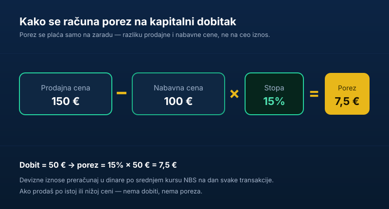
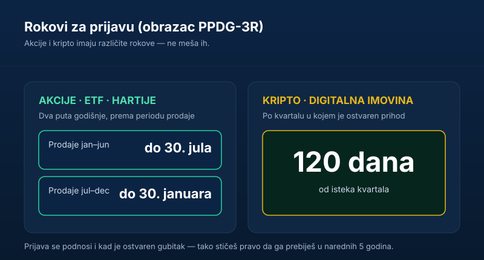

Prodao si akcije i ostao u plusu. Ili si izašao iz kripta posle dobre godine. Ili ti je ETF lepo porastao pa si nešto unovčio. Čestitam — a sad dolazi deo o kome niko ne priča dok ne bude kasno: **porez na kapitalni dobitak.**

Dobra vest je da to nije ni komplikovano ni strašno kad jednom shvatiš logiku. Loša vest je da te neznanje ovde košta — kamatom, kaznom i nervozom kad ti stigne dopis iz Poreske uprave. Zato hajde da prođemo sve **crno na belo**: koliko se plaća, na šta, kada, koji su izuzeci i kako tačno da podneseš prijavu — korak po korak.

> **Važno:** ovaj tekst je informativnog karaktera i ne predstavlja poreski ni investicioni savet. Pravila se menjaju, a svaka situacija ume da ima svoje specifičnosti. Za konkretan slučaj — naročito veće iznose, nasleđe ili strane dividende — konsultuj poreskog savetnika ili Poresku upravu.

## Šta je kapitalni dobitak

**Kapitalni dobitak je razlika između cene po kojoj si nešto prodao i cene po kojoj si to kupio.** Ako si akciju kupio za 100 evra, a prodao za 150, tvoj kapitalni dobitak je 50 evra. Porez se plaća **samo na tih 50** — ne na celih 150.

To je ključna stvar koju mnogi pogrešno shvate: ne oporezuje se promet, nego **zarada**. Ako prodaš po istoj ili nižoj ceni od one po kojoj si kupio, kapitalnog dobitka nema, pa nema ni poreza.

Stopa poreza na kapitalni dobitak za fizička lica u Srbiji je **15%**.

Sve je uređeno [Zakonom o porezu na dohodak građana](https://www.paragraf.rs/propisi/zakon-o-porezu-na-dohodak-gradjana.html) (članovi 72–80). Mi ćemo ga ovde prevesti na ljudski jezik.

## Na šta se plaća porez na kapitalni dobitak

Porez na kapitalni dobitak nije samo „porez na akcije". Plaća se na prenos više vrsta imovine. Za nekoga ko investira, najvažnije su:

- **akcije** domaćih i stranih kompanija,
- **investicione jedinice** fondova, uključujući ETF-ove i alternativne investicione fondove,
- **obveznice** i druge hartije od vrednosti (uz važan izuzetak za državne — vidi dole),
- **digitalna imovina** — kriptovalute (Bitcoin, Ethereum…) i digitalni tokeni,
- **udeli** u privrednim društvima,
- **nepokretnosti** (stanovi, kuće, placevi) i pojedina autorska i imovinska prava.

Pod „prenosom" se ne smatra samo klasična prodaja za novac, nego i svaki drugi prenos uz naknadu — na primer unos akcija kao nenovčanog uloga u firmu, ili, kod kripta, **zamena jedne valute za drugu**.

Ako tek planiraš da uđeš u ovo, prvo pročitaj [kako iz Srbije da kupiš akcije i ETF-ove](/blog/ulaganje-novca-u-akcije/) i [zašto je ETF najčešće jeftiniji izbor od klasičnih fondova](/blog/zasto-ne-investirati-u-fondove/) — porez je tek poslednja karika u tom lancu.

## Kako se računa porez — uz konkretan primer

Formula je prosta:

> **(Prodajna cena − Nabavna cena) × 15% = porez**

Pod nabavnom cenom se smatra ono što si stvarno platio, uključujući provizije i troškove koje možeš da dokažeš. Pod prodajnom — ono što si stvarno dobio.

**Primer (akcije u dolarima).** Kupio si 10 akcija po 600 dolara i kasnije ih prodao po 712 dolara. Pošto se sve prijavljuje u dinarima, svaki iznos preračunavaš u dinare po **srednjem kursu Narodne banke Srbije na dan te transakcije** — posebno za dan kupovine, posebno za dan prodaje. Tek na dinarsku razliku primenjuješ 15%.

Ovo je sitnica koju ljudi stalno preskaču: nije bitna samo razlika u dolarima, nego i kako se kurs dinara kretao između kupovine i prodaje. Ponekad ti to ide u korist, ponekad na štetu.

**Primer (kripto).** Kupio si coin za 20 evra, prodao za 50. Kapitalni dobitak je 30 evra, porez je 15% od dinarske protivvrednosti tih 30 evra.

## Najvažniji izuzeci: kada NE plaćaš (i ne prijavljuješ)

Ovo je deo koji ti može uštedeti najviše. Zakon izričito kaže da se **kapitalnim dobitkom ne smatra** razlika nastala kada:

- si imovinu (pravo, udeo ili hartiju od vrednosti) imao u vlasništvu **neprekidno najmanje deset godina** pre prodaje,
- je stečena **nasleđem u prvom naslednom redu**,
- se prenos vrši **između bračnih drugova i krvnih srodnika u pravoj liniji**,
- se prenos vrši između razvedenih supružnika, a u neposrednoj je vezi sa razvodom,
- se prenose **dužničke hartije od vrednosti čiji je izdavalac Republika Srbija, AP, jedinica lokalne samouprave ili NBS** — dakle, državne i narodne obveznice,
- se u statusnoj promeni firme zamenjuju akcije/udeli za akcije/udele u skladu sa zakonom.

Za sve ove slučajeve **ne plaćaš porez i ne podnosiš prijavu.**

Pravilo od deset godina je posebno zanimljivo za dugoročne investitore: ako kupiš i držiš široki ETF deceniju i po, pa prodaš — po ovom osnovu možeš biti oslobođen poreza. To je još jedan argument u prilog [dugoročnom, strpljivom pristupu umesto stalne trgovine](/blog/diversifikacija-portfolija/). Za digitalnu imovinu isto pravilo verovatno važi, ali zvanično mišljenje nadležnih još nije izdato, pa tu budi oprezan.

## Kapitalni gubitak nije kraj sveta — i njega prijavljuješ

Ako si prodao u minusu, ostvario si **kapitalni gubitak**. I to se prijavljuje (kod hartija od vrednosti prijava se podnosi bez obzira na to da li je dobitak ili gubitak).

Zašto bi prijavljivao gubitak? Zato što ti se **isplati**: na osnovu prijave Poreska uprava donosi rešenje kojim utvrđuje gubitak, a taj gubitak možeš da **prebiješ sa budućim kapitalnim dobicima u narednih pet godina**. Dakle, loša godina ti može smanjiti porez u nekoj od narednih dobrih godina.

## Specifičnosti za akcije i ETF

**Rok za prijavu — dva puta godišnje:**

- za prodaje u periodu **januar–jun**, prijava do **30. jula** tekuće godine,
- za prodaje u periodu **jul–decembar**, prijava do **30. januara** naredne godine.

U jednu prijavu unosiš sve prodaje iz tog šestomesečnog perioda. Nabavnu i prodajnu cenu dokazuješ **potvrdama o transakcijama** iz brokerskog naloga.

Mali bonus: ulaganjem u **alternativni investicioni fond** možeš ostvariti i poreski kredit na godišnji porez na dohodak građana — do 50% uloženog u toj godini, a najviše do 50% utvrđene godišnje poreske obaveze. To je posebna olakšica, odvojena od priče o kapitalnom dobitku.

## Specifičnosti za kripto (digitalnu imovinu)

Kripto se oporezuje po istoj stopi od 15%, ali ima par bitnih razlika:

- **Oporezivi događaj je svaka trgovina** — i prodaja za novac, i **zamena jedne kriptovalute za drugu.** Mnogi misle da se porez plaća tek kad „izvuku u dinare/evre"; to nije tačno.
- **Rok za prijavu je 120 dana od isteka kvartala** u kojem si ostvario prihod od prenosa digitalne imovine.
- **Dokaz o nabavnoj ceni je sveti gral.** Ako ne možeš da dokažeš po koliko si kupio, realno je očekivati da Poreska uprava uzme nabavnu cenu kao nula dinara — pa se onda ceo iznos prodaje tretira kao dobit. Čuvaj svaku potvrdu sa platforme i menjačnice.
- **Olakšica za reinvestiranje:** ako novac od prodaje kripta u roku od **90 dana** uložiš u osnovni kapital domaćeg privrednog društva ili investicionog fonda, možeš biti oslobođen **50% poreza**. Ako to uradiš kasnije, ali u roku od **12 meseci**, imaš pravo na **povraćaj 50%** plaćenog poreza.
- **Rudarenje** se priznaje kao način sticanja: nabavnom cenom se smatraju dokumentovani troškovi (struja, oprema) koje možeš da dokažeš.

Ako pratiš tržište i tek razmišljaš kako da rasporediš novac, koristi može i tekst [gde uložiti prvih 1.000 evra](/blog/gde-uloziti-1000-evra/) — porez planiraš pre prve kupovine, ne posle prve prodaje.

## Kako da podneseš PPDG-3R preko ePoreza — korak po korak

Prijava se podnosi na obrascu **PPDG-3R**, elektronski preko portala [ePorezi](https://eporezi.purs.gov.rs/). Treba ti **kvalifikovani elektronski sertifikat** (i instalirani drajveri) ili **potpis u oblaku** (ConsentID aplikacija).

1. **Sakupi potvrde o transakcijama.** Iz brokerskog naloga ili sa kripto platforme izvuci datume, količine, cene i provizije za svaku kupovinu i prodaju.
2. **Preračunaj devizne iznose u dinare** po srednjem kursu NBS — za svaki dan kupovine i svaki dan prodaje posebno.
3. **Prijavi se na ePorezi** sertifikatom ili potpisom u oblaku.
4. **Izaberi obrazac PPDG-3R** u delu „Porezi i doprinosi". Vrsta prijave je 1 (ako podnosiš posle roka, bira se 3); osnov je prenos hartija od vrednosti odnosno digitalne imovine. Kao datum ostvarivanja prihoda kod hartija unosiš 30.06. ili 31.12.
5. **Unesi prodaje pa nabavke.** Za svaku prodaju dodaš odgovarajuće nabavke, hronološki, dok ne pokriješ sve prodate komade. Sistem sam računa dobitak i porez.
6. **Priloži dokaze, sačuvaj posle svake rubrike, potpiši i podnesi.** Ako nešto fali, sistem neće dati da podneseš dok ne popraviš.

> Savet: čuvaj sačuvano. Klikni „Sačuvaj" posle svakog dela — ako nešto preskočiš, prijava ne prolazi i prijavljuje grešku.

## Šta se dešava posle prijave

Poreska uprava ne naplaćuje porez automatski po stopi sa tvoje prijave — ona donosi **rešenje**. Tek na osnovu tog rešenja plaćaš porez, i to u roku od **15 dana** od prijema. Ako podneseš prijavu, a porez ne stigne odmah — to je normalno, čekaš rešenje.

Ako prijavu **ne podneseš**, Poreska uprava može sama da utvrdi obavezu na osnovu podataka kojima raspolaže (a podaci o prekograničnim transakcijama sve više cirkulišu). Tada rizikuješ **zateznu kamatu i prekršajnu kaznu** — što je gotovo uvek skuplje od samog poreza.

## Dividende nisu kapitalni dobitak

Česta zabuna: **dividenda** (deo dobiti koji ti firma isplati dok držiš akciju) i **kapitalni dobitak** (zarada kad prodaš akciju) su dve različite stvari, sa različitim poreskim tretmanom. Dividende se oporezuju zasebno i **ne idu kroz PPDG-3R.** Kod domaćih dividendi porez se po pravilu obustavlja po odbitku, dok strane dividende (npr. od američkih akcija) najčešće moraš sam da prijaviš, uz mogućnost uračunavanja poreza plaćenog u inostranstvu po osnovu ugovora o izbegavanju dvostrukog oporezivanja. Za to je pametno pitati poreskog savetnika.

## Najčešće greške

- **Misle da se kripto oporezuje tek pri izlasku u fiat.** Ne — i zamena coin-a za coin je oporeziv prenos.
- **Ne čuvaju potvrde o kupovini.** Bez nabavne cene, porez se obračunava kao da si sve dobio besplatno.
- **Zaborave da prijave gubitak.** Time bacaju pravo da ga prebiju sa budućim dobicima.
- **Ne preračunavaju po kursu NBS na dan transakcije**, nego po nekom „prosečnom" kursu.
- **Probiju rok**, pa na porez dodaju i kamatu i kaznu.

## Zaključak

Porez na kapitalni dobitak je 15% — ali se plaća **samo na zaradu**, ima ozbiljne izuzetke (deset godina, državne obveznice, prenosi u porodici) i jasne rokove. Ako vodiš urednu evidenciju kupovina i prodaja, podnošenje PPDG-3R je pola sata posla, a ne noćna mora.

Najvažnije pravilo: porez planiraš **pre** nego što kupiš, a evidenciju vodiš **od prvog dana** — ne kad ti stigne dopis. Sve ostalo je tehnika.

---

### Izvori i korisni linkovi

- [Zakon o porezu na dohodak građana — Paragraf](https://www.paragraf.rs/propisi/zakon-o-porezu-na-dohodak-gradjana.html)
- [Obrazac PPDG-3R — poreska prijava za kapitalne dobitke (Paragraf)](https://www.paragraf.rs/obrasci-paragraf/obrazac-ppdg-3r-poreska-prijava-za-utvrdjivanje-poreza-na-kapitalne-dobitke.html)
- [Uputstvo Poreske uprave za PPDG-3R](https://www.purs.gov.rs/sr/aktuelnosti/Ostalo/4580/uputstvo-za-podnosenje-poreske-prijave-za-utvrdjivanje-poreza-na-kapitalne-dobitke-na-obrascu-ppdg--3r.html)
- [Portal ePorezi](https://eporezi.purs.gov.rs/)
- [Narodna banka Srbije — srednji kurs](https://www.nbs.rs/sr/finansijsko_trziste/medjubankarsko/kursna_lista/)
