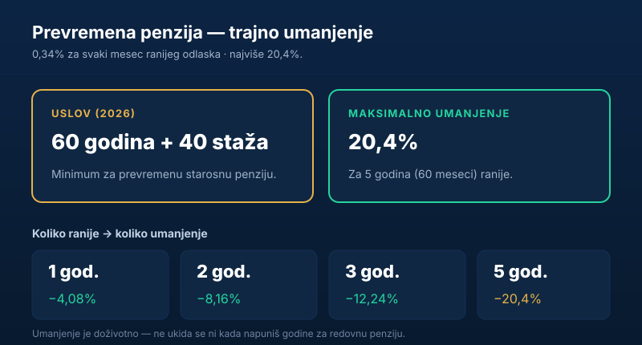

Mnogi koji su rano počeli da rade dođu do tačke kada pomisle: „imam dovoljno staža, zašto da čekam još godinama?" Tu nastupa **prevremena penzija** — mogućnost da se u penziju ode ranije, ali po ceni **trajno manjeg iznosa**. U ovom vodiču objašnjavamo uslove za 2026, kako se računa umanjenje i kada raniji odlazak zaista ima smisla.

Kratko, za one kojima treba odmah:

> Za **prevremenu starosnu penziju** u 2026. treba **60 godina života i 40 godina staža**. Penzija se trajno umanjuje za **0,34% po mesecu** ranijeg odlaska, najviše **20,4%**. To umanjenje je **doživotno**.

## Uslovi za prevremenu penziju u 2026.

Prevremena starosna penzija traži da se **istovremeno** ispune dva uslova:

| Uslov | Vrednost (2026) |
|---|---|
| Minimalni staž | 40 godina osiguranja |
| Minimalne godine života | 60 godina |

Oba uslova moraju biti zadovoljena u istom trenutku. Nije dovoljno imati 40 godina staža ako nemaš 60 godina života, niti obrnuto. Razlika u odnosu na [redovne uslove za penziju](/blog/uslovi-za-penziju-2026/) je u tome što se ovde svesno ide ranije, uz prihvatanje umanjenja.

## Kako se računa umanjenje

Cena ranijeg odlaska je **trajno umanjenje** penzije. Pravilo je jednostavno:

- za **svaki mesec** ranijeg odlaska (u odnosu na punu starosnu granicu) penzija se smanjuje za **0,34%**,
- **maksimalno** umanjenje iznosi **20,4%** — što odgovara odlasku **pet godina** ranije.

Pune starosne granice u 2026. su 65 godina za muškarce i 64 godine za žene. Koliko ti meseci fali do te granice — toliko puta 0,34%.

| Koliko ranije | Računica | Trajno umanjenje |
|---|---|---|
| 1 godina (12 meseci) | 12 × 0,34% | 4,08% |
| 2 godine (24 meseca) | 24 × 0,34% | 8,16% |
| 3 godine (36 meseci) | 36 × 0,34% | 12,24% |
| 5 godina (60 meseci) | 60 × 0,34% | 20,40% (maksimum) |

## Primer obračuna

Recimo da bi tvoja **puna** starosna penzija iznosila **70.000 dinara**, a razmišljaš da odeš **dve godine ranije**.

- Umanjenje: 24 meseca × 0,34% = **8,16%**.
- Iznos umanjenja: 70.000 × 8,16% = **5.712 dinara**.
- Prevremena penzija: 70.000 − 5.712 = **64.288 dinara** — i to **doživotno**.

Dakle, za dve godine ranijeg primanja penzije, trajno se odričeš oko 5.700 dinara mesečno. Da bi izračunao svoju punu penziju pre umanjenja, pogledaj vodič [kako se računa penzija u Srbiji](/blog/kako-se-racuna-penzija-u-srbiji/).

## Najvažnije: umanjenje je doživotno

Ovo je deo koji najviše ljudi iznenadi. Umanjenje **ne nestaje** onog dana kada napuniš 65 godina i „stigneš" do redovne starosne granice. Ostaje isto do kraja života.

> **Pažnja:** prevremena penzija nije „privremeno manja pa se izjednači". Ko ode pet godina ranije, prima 20,4% manju penziju **zauvek** — i kroz deset i kroz dvadeset godina.

Zato raniji odlazak treba shvatiti kao trajnu odluku, a ne kao premošćavanje do „prave" penzije.

## Da li se isplati otići ranije?

Ne postoji univerzalan odgovor — to je lična računica koja zavisi od nekoliko stvari:

- **Koliko ti meseci fali.** Što si bliži punoj granici, to je umanjenje manje, pa raniji odlazak manje „boli".
- **Da li ti je novac potreban sada.** Penzija koju primaš ranije takođe ima vrednost — naročito ako bi inače ostao bez prihoda.
- **Zdravlje i planovi.** Niko ne voli da o tome razmišlja, ali očekivano trajanje primanja penzije menja računicu.

Gruba logika: ako ti fali malo meseci i imaš stabilan prihod, češće se isplati **sačekati** punu penziju. Ako ti fali dosta, a već si bez posla, raniji odlazak uz umanjenje ume da bude manje zlo. U svakom slučaju, pre odluke proveri tačne brojeve kod [Fonda PIO](https://www.pio.rs/).

## Prevremena vs starosna vs „45 godina staža"

Da ne bude zabune oko tri slična pojma:

- **Prevremena starosna penzija** — 60 godina + 40 staža, uz **trajno umanjenje**.
- **Redovna starosna penzija** — 65 (muškarci) / 64 (žene) + 15 staža, **bez umanjenja**.
- **Penzija sa 45 godina staža** — bez obzira na godine života, **bez umanjenja**.

Najčešća greška je mešanje prevremene penzije (40 staža, sa umanjenjem) i pune penzije po stažu (45 godina, bez umanjenja). Tih pet godina staža prave ogromnu razliku.

## Kako se podnosi zahtev za prevremenu penziju

Pravo na prevremenu penziju ne ostvaruje se automatski — moraš da podneseš **zahtev** Republičkom fondu PIO. Postupak je u osnovi isti kao za starosnu penziju:

1. **Proveri uslove i staž** u evidenciji Fonda pre podnošenja, da ne bi bilo iznenađenja sa nedostajućim periodima.
2. **Podnesi zahtev** Fondu PIO — lično u nadležnoj filijali ili elektronski, uz potrebnu dokumentaciju (lična karta, dokazi o stažu koji eventualno nisu u evidenciji).
3. **Sačekaj rešenje** u kojem Fond utvrđuje pravo, tačan procenat umanjenja i konačan iznos.

Datum podnošenja je bitan: penzija po pravilu teče od ispunjenja uslova i podnošenja zahteva, a ne unazad. Zato nema smisla žuriti pre nego što ispuniš oba uslova, ali ni odlagati kada si već odlučio.

## Da li možeš da radiš uz prevremenu penziju

Ovo je čest izvor zabune. Prevremena penzija je puna penzija (samo trajno umanjena), ali **zasnivanje radnog odnosa uz osiguranje** dok primaš prevremenu penziju ima posebna pravila i može da utiče na isplatu. U praksi, ko se ponovo zaposli sa punim osiguranjem, ulazi u situaciju koja se ceni pojedinačno — pa pre takve odluke treba proveriti svoj konkretan slučaj kod Fonda.

Povremeni, honorarni rad i prevremena penzija takođe se različito tretiraju u zavisnosti od oblika angažovanja. Suština: prevremena penzija nije zamišljena kao „penzija plus pun posao", pa ako planiraš da nastaviš ozbiljno da radiš, možda ti se više isplati da sačekaš [redovnu starosnu penziju](/blog/uslovi-za-penziju-2026/) — koja takvih ograničenja nema.

## Zaključak

Prevremena penzija u 2026. dostupna je sa **60 godina života i 40 godina staža**, ali nosi **trajno umanjenje** od 0,34% po mesecu ranijeg odlaska, do najviše 20,4%. Ključno je razumeti da je to umanjenje **doživotno** — pa odluku treba doneti tek pošto izračunaš koliko te konkretno košta i uporediš sa koristima ranijeg odlaska. Sledeći korak, ako ostaješ u sistemu, jeste da proveriš [koliko ti staža tačno ulazi u obračun](/blog/penzijski-staz/).

---

*Ovaj tekst je informativnog karaktera i ne predstavlja pravni ni finansijski savet. Tačan datum sticanja prava, visinu umanjenja i konačan iznos penzije utvrđuje isključivo Republički fond za penzijsko i invalidsko osiguranje (PIO). Uslovi se menjaju iz godine u godinu, pa pre odluke proveri aktuelne podatke kod nadležnog Fonda.*
