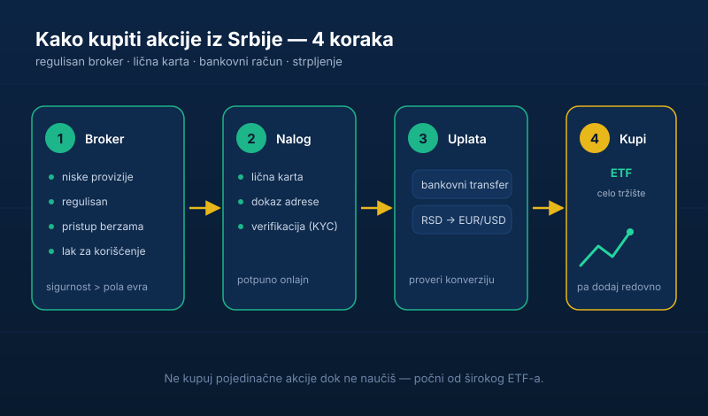

„Ma to mogu samo Amerikanci, ne može se to iz Srbije." Toliko puta sam to čuo. I toliko puta nije tačno.

Iz Srbije danas možeš da kupiš akcije Epla, Majkrosofta ili globalni ETF lakše nego ikada. Treba ti samo internet, lična karta i malo volje da naučiš. Ovaj vodič ti pokazuje **kako da kupiš akcije iz Srbije korak po korak** — od izbora brokera do prve kupovine i poreza koji prati zaradu.

> **Napomena:** ovaj tekst je informativnog karaktera i ne predstavlja investicioni savet. Odluku o ulaganju donosiš sam, na osnovu sopstvene procene i, po potrebi, saveta licenciranog stručnjaka.

## Šta su akcije, ukratko

Akcija je **vlasnički udeo u kompaniji**. Kad kupiš akciju Epla, ti si bukvalno postao (sitni) suvlasnik Epla — imaš pravo na deo dobiti koju firma deli kroz dividende i profitiraš ako vrednost firme raste. To je suštinska razlika u odnosu na kladionicu: ne kladiš se na ishod, nego **postaješ vlasnik produktivne imovine**.

Zato i ima smisla. Dok ti [pare na tekućem računu polako jede inflacija](/blog/zasto-je-investiranje-bitno/), dobre kompanije rastu, zarađuju i taj rast dele sa svojim vlasnicima — a jedan od njih možeš da budeš i ti.

## Korak 1: Izaberi brokera

Broker je posrednik preko kog kupuješ akcije. Postoji više platformi koje rade sa klijentima iz Srbije. Kad biraš, gledaj četiri stvari:

- **Provizije** — koliko ti naplaćuju po kupovini i prodaji, i da li postoji mesečna naknada. Niže je bolje, pogotovo za male iznose.
- **Regulacija** — biraj brokera koji je ozbiljno regulisan (npr. kod nadzornog tela u EU), ne neku sumnjivu aplikaciju koja se pojavila prošle godine. U Srbiji tržište kapitala nadzire <a href="https://www.sec.gov.rs/" target="_blank" rel="noopener">Komisija za hartije od vrednosti</a>.
- **Šta nudi** — da li imaš pristup berzama i instrumentima koji te zanimaju (američke i evropske akcije, ETF-ovi).
- **Lakoća korišćenja** — ako je aplikacija haos, nećeš je koristiti. Probaj demo ako postoji.

Ne juri samo najnižu proviziju — sigurnost i regulacija su važnije od pola evra razlike. Broker drži tvoj novac i tvoje hartije; tu se ne štedi na pogrešnom mestu.

## Korak 2: Otvori i verifikuj nalog

Otvaranje naloga je danas potpuno onlajn. Trebaće ti **lična karta ili pasoš** i obično **dokaz adrese** (npr. račun za režije ili izvod iz banke). Ovaj postupak se zove KYC („upoznaj svog klijenta") i služi da se spreči pranje novca — normalan je i kod svih ozbiljnih brokera.

Verifikacija traje od par minuta do par dana. Dok čekaš, pročitaj uslove: koje valute podržava, koliko košta uplata i isplata, i kako se naplaćuje konverzija dinara u evre ili dolare.

## Korak 3: Uplati novac i kupi prvu poziciju

Kad ti je nalog spreman, uplaćuješ novac (obično bankovnim transferom) i — to je to, možeš da kupuješ.

Savet za početak: **ne kupuj pojedinačne akcije dok ne naučiš.** Kreni od širokog **indeksnog ETF-a** koji prati celo tržište (na primer globalni indeks ili indeks velikih američkih kompanija). Time odmah razbacuješ rizik na stotine firmi umesto da se kockaš na jednu. O tome zašto je [diversifikacija obavezna pišemo detaljno ovde](/blog/diversifikacija-portfolija/), a [poređenje fondova i ETF-ova je u posebnom tekstu](/blog/zasto-ne-investirati-u-fondove/).

Ako tek skupljaš prvi ulog, pogledaj i [šta pametno da uradiš sa prvih 1.000 evra](/blog/gde-uloziti-1000-evra/) — redosled poteza je tu važniji od izbora akcije.

## Korak 4: Porez na zaradu od akcija (ne preskači ovo)

Ovo je deo koji početnici najčešće preskoče — pa se iznenade. U Srbiji:

- **Kapitalni dobitak** (razlika između prodajne i nabavne cene) oporezuje se po stopi od **15%**. Prijavu podnosiš sam Poreskoj upravi nakon prodaje.
- **Dividende** koje ti firma isplati takođe podležu porezu.
- Ako si akcije držao **neprekidno najmanje 10 godina** pre prodaje, kapitalni dobitak je **oslobođen** poreza — još jedan razlog da razmišljaš dugoročno.
- Kapitalni gubitak možeš da koristiš za umanjenje budućih dobitaka u narednih pet godina.

Detalje i obrasce uvek proveri na zvaničnom izvoru — <a href="https://www.purs.gov.rs/" target="_blank" rel="noopener">Poreska uprava Republike Srbije</a>. Pošto se propisi menjaju, a tvoja situacija može da bude specifična, za veće iznose se posavetuj sa knjigovođom.

## Greške koje skoro svi prave na početku

- **Ulažu sve odjednom, pa paniče kad padne.** Ulaži postepeno i redovno — taj pristup se zove „prosečna cena" i štiti te od lošeg tajminga.
- **Jure „vruće" akcije iz Tiktok preporuka.** To nije strategija, to je [kockanje prerušeno u investiranje](/blog/investiranje-nije-kockanje/).
- **Prodaju u panici čim cena padne.** Pad je normalan. Prodaja u panici je način da loš dan pretvoriš u trajni gubitak.
- **Bulje u cene svaki dan.** Što češće gledaš portfolio, [to ćeš lošije investirati](/blog/redovno-pracenje-cena-akcija/).
- **Čekaju „savršen trenutak".** [Savršen trenutak ne postoji](/blog/pravo-vreme-za-investiranje/). Najbolji trenutak za početak je bio pre deset godina. Drugi najbolji je danas.

## Pre prve kupovine: dve provere

Pre nego što uplatiš prvi evro na brokerski nalog, uveri se da si rešio temelje:

1. **Imaš li [rezervu za hitne slučajeve](/blog/hitna-rezerva-fond-za-crne-dane/)?** Ne ulažeš poslednje pare koje imaš — jer ako ti zatrebaju baš kad tržište padne, moraš da prodaješ na gubitku.
2. **Imaš li skupe dugove?** Otplata kredita sa 15% kamate ti je zagarantovan „prinos" od 15%. Nijedna akcija ti to ne garantuje.

Ako želiš da uđeš dublje u logiku biranja kvalitetnih firmi po poštenoj ceni, pročitaj [investiranje po vrednosti](/blog/investiranje-po-vrednosti/).

## Suština

Ulaganje u akcije iz Srbije više nije ni komplikovano ni rezervisano za bogate. Treba ti regulisan broker, lična karta, malo strpljenja i navika da uplaćuješ redovno. Ne moraš da budeš genije da bi investirao — moraš da budeš strpljiv, redovan i da ne paničiš.

Kreni od širokog ETF-a, uplaćuj svaki mesec, ne diraj kad padne i prijavi porez kad dođe vreme. To je dosadno. I baš zato radi.
