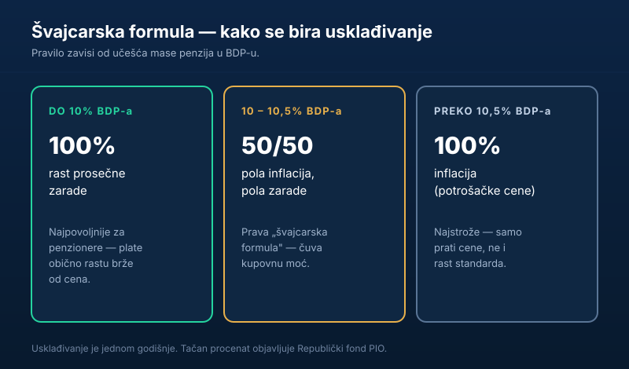

Svake godine se u isto vreme vrti ista priča: „penzije se povećavaju za toliko i toliko odsto". Ali šta to zapravo znači, odakle taj procenat i da li je to **pravo povećanje** ili samo praćenje cena? U nastavku objašnjavamo kako funkcioniše **usklađivanje penzija** u Srbiji, kako radi čuvena **švajcarska formula** i kada možeš da očekuješ veću penziju.

Kratko, za one kojima treba odmah:

> Penzije se usklađuju **jednom godišnje**, po **švajcarskoj formuli** koja kombinuje rast cena i rast zarada. Poslednje usklađivanje iznosilo je **12,2%** (od decembra 2025), čime je prosečna penzija dostigla oko **56.860 dinara**.

## Šta znači „usklađivanje" penzija

Usklađivanje je zakonom propisano **periodično prilagođavanje iznosa penzija** kako one ne bi gubile vrednost dok cene i plate rastu. Penzija koja godinama stoji na istom iznosu, uz inflaciju, realno se smanjuje — za istu sumu kupiš sve manje. Usklađivanje treba da spreči baš to.

Važno je odmah razdvojiti dva pojma koja se u javnosti stalno mešaju:

- **Usklađivanje** = održavanje kupovne moći (penzija prati cene i/ili plate).
- **Vanredno povećanje** = politička odluka da se penzije podignu iznad onoga što formula nalaže.

Kada čuješ „penzije rastu za X%", to je gotovo uvek **redovno usklađivanje**, a ne poklon — sistem samo radi ono što mu zakon propisuje.

## Kako radi švajcarska formula

Srbija penzije usklađuje takozvanom **švajcarskom formulom** (u praksi proširenom verzijom, „švajcarska formula plus"), koja je na snazi od 1. januara 2023. Suština je da se usklađivanje ne vezuje samo za inflaciju, već i za **rast prosečne zarade** — pa penzioneri delom prate i rast životnog standarda zaposlenih.

Koliko se kog dela uzima, ne zavisi od raspoloženja, već od **učešća mase penzija u bruto domaćem proizvodu (BDP)**. Logika je da sistem mora ostati održiv: što više novca odlazi na penzije u odnosu na privredu, to je usklađivanje opreznije.

| Učešće penzija u BDP-u | Penzije se usklađuju sa… | Efekat |
|---|---|---|
| **do 10%** | rastom prosečne zarade (100%) | najpovoljnije — plate obično rastu brže od cena |
| **10 – 10,5%** | pola inflacija, pola zarade (50/50) | klasična švajcarska formula |
| **preko 10,5%** | inflacijom (100%) | najstrože — prati samo cene |

Drugim rečima, kada je penzioni sistem „lakši" za budžet (manje učešće u BDP-u), penzioneri dobijaju veći deo rasta plata. Kada masa penzija naraste, formula se prebacuje na inflaciju da bi sistem ostao u ravnoteži.

## Kada i koliko su penzije rasle

Procenat usklađivanja se obračunava na osnovu zvaničnih podataka [Republičkog zavoda za statistiku](https://www.stat.gov.rs/) o inflaciji i kretanju zarada, a primenjuje se **jednom godišnje** — uvećani iznos kreće uz **decembarsku penziju**, koja se isplaćuje početkom naredne godine.

Nekoliko poslednjih ciklusa, za osećaj reda veličine:

- **Januar 2023:** usklađivanje od oko **11,2%**, uz prelazak na novu formulu.
- **Decembar 2025 (za 2026):** usklađivanje od **12,2%**, čime prosečna penzija raste na oko **56.860 dinara** — približno 6.000 dinara više nego godinu ranije.

Brojevi se menjaju iz godine u godinu, pa ovaj članak ažuriramo posle svakog zvaničnog usklađivanja. Aktuelni, zvaničan iznos uvek možeš proveriti na sajtu [Fonda PIO](https://www.pio.rs/).

### Primer: koliko 12,2% znači u dinarima

Pošto je usklađivanje **procentualno**, najlakše ga je razumeti na konkretnom iznosu. Uzmimo usklađivanje od **12,2%**:

| Penzija pre usklađivanja | Rast (12,2%) | Penzija posle |
|---|---|---|
| 40.000 din | +4.880 din | 44.880 din |
| 56.000 din | +6.832 din | 62.832 din |
| 80.000 din | +9.760 din | 89.760 din |

Vidi se zašto isti procenat „ne deluje isto" za svakoga: penzioner sa 80.000 dinara dobija skoro duplo veći dinarski rast od onog sa 40.000, iako je procenat identičan. Zato udruženja penzionera povremeno traže i **linearno** (isti dinarski iznos za sve), umesto čisto procentualnog usklađivanja.

## Da li je to realno povećanje ili ne

Ovo je deo koji najviše zbunjuje. Usklađivanje **nije isto što i realno bogaćenje** penzionera. Ako penzija poraste za 12%, a cene su u istom periodu skočile 10%, realni dobitak je samo oko 2% — ostatak je puko „hvatanje koraka" sa inflacijom.

Zato stručnjaci često ističu da švajcarska formula **čuva kupovnu moć, ali je ne podiže dramatično**. Realni rast standarda penzionera postoji samo kada usklađivanje prati brži rast zarada (donji prag formule) ili kada se odvoji vanredno povećanje mimo formule.

Za penzionera u praksi to znači jednostavnu stvar: na povećanje treba gledati **u odnosu na inflaciju**, a ne kao na čist plus. Ako želiš da razumeš kako se uopšte dobija tvoj osnovni iznos penzije na koji se ovo usklađivanje primenjuje, pogledaj vodič [kako se računa penzija u Srbiji](/blog/kako-se-racuna-penzija-u-srbiji/).

## Česte zablude o usklađivanju

**„Penzije se usklađuju dva puta godišnje."** Nekada jesu (april i oktobar), ali po važećoj formuli usklađivanje je **jednom godišnje**. Udruženja penzionera povremeno traže povratak na dva ciklusa, ali to za sada nije pravilo.

**„Procenat određuje vlada kako joj odgovara."** Procenat proizlazi iz **formule i zvanične statistike**, a ne iz proizvoljne odluke. Politika može da doda vanredno povećanje povrh formule, ali samo usklađivanje je matematika.

**„Svi penzioneri dobijaju isti dinarski iznos."** Ne — usklađivanje je **procentualno**, pa veće penzije rastu i za više dinara, dok je za najniže penzije dinarski rast manji (iako je procenat isti).

## Šta ovo znači za tebe

Ako si već u penziji, usklađivanje je nešto na šta **ne možeš da utičeš** — ali možeš da razumeš zašto ti iznos raste baš toliko i da ga gledaš realno, u odnosu na cene. Ako tek planiraš penziju, korisno je znati da se sistem trudi da **prati inflaciju**, ali da se na to dugoročno ne treba oslanjati kao na jedini izvor sigurnosti.

Upravo zato je pametno na vreme izgraditi i sopstveni „jastuk": pogledaj kako da napraviš [hitnu rezervu za crne dane](/blog/hitna-rezerva-fond-za-crne-dane/) i kako da [pametno upravljaš ličnim finansijama](/blog/kako-pametno-upravljati-finansijama/). A ako proveravaš da li uopšte ispunjavaš uslove, sve je pregledno u tekstu o [uslovima za penziju u 2026](/blog/uslovi-za-penziju-2026/).

## Zaključak

Usklađivanje penzija u Srbiji radi po **švajcarskoj formuli**: jednom godišnje, kombinujući rast cena i rast zarada, uz korekciju koja zavisi od učešća penzija u BDP-u. Poslednje usklađivanje od **12,2%** podiglo je prosečnu penziju na oko **56.860 dinara**. Ključno je razumeti da je cilj te formule da **sačuva kupovnu moć**, a ne da donese veliki realni skok — pa svaki procenat treba čitati zajedno sa inflacijom.

---

*Ovaj tekst je informativnog karaktera i ne predstavlja pravni ni finansijski savet. Tačan procenat usklađivanja, datum primene i visinu pojedinačne penzije utvrđuje isključivo Republički fond za penzijsko i invalidsko osiguranje (PIO). Podaci se menjaju iz godine u godinu, pa pre donošenja odluka proveri aktuelne informacije kod nadležnog Fonda.*
