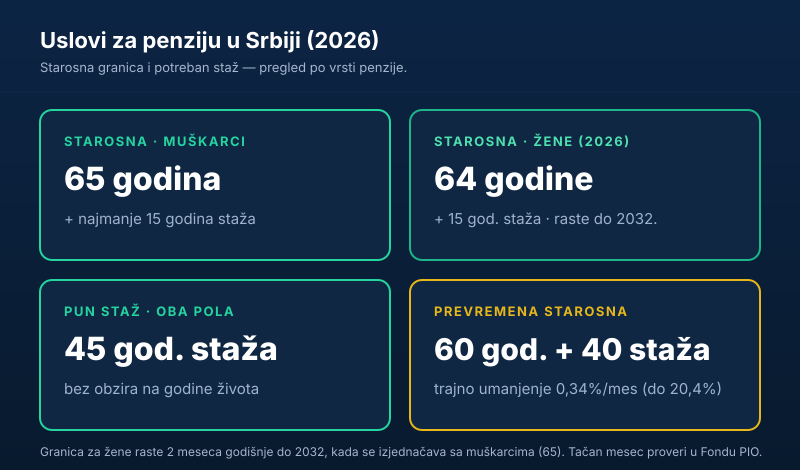

Pitanje koje pre ili kasnije svako sebi postavi glasi: **kada ja mogu u penziju?** Odgovor u 2026. zavisi od dve stvari — koliko imaš **godina života** i koliko imaš **godina staža**. U nastavku ti dajemo tačne uslove za sve vrste penzija, pregledno i bez pravničkog žargona.

Kratko, za one kojima treba odmah:

> U **2026.** godini u starosnu penziju idu **muškarci sa 65 godina** i **žene sa 64 godine** života, uz najmanje **15 godina staža**. Ko ima **45 godina staža** može u penziju **bez obzira na godine života**.

## Uslovi za starosnu (redovnu) penziju u 2026.

Starosna penzija je „klasičan" odlazak u penziju kada se ispune godine života i minimalni staž.

| Ko | Godine života (2026) | Minimalni staž |
|---|---|---|
| Muškarci | 65 godina | 15 godina |
| Žene | 64 godine | 15 godina |

Granica za žene nije konačna: **povećava se za dva meseca svake godine**, sve do **2032.**, kada će se izjednačiti sa muškarcima — 65 godina života uz najmanje 15 godina staža. Zato je za žene rođene u određenim godinama bitno proveriti **tačan mesec** sticanja prava, jer se pomera iz godine u godinu.

## Penzija samo na osnovu staža (45 godina)

Postoji i put koji ne gleda godine života. **Ko navrši 45 godina staža osiguranja, stiče pravo na starosnu penziju bez obzira na to koliko ima godina.** Uslov je da su svi doprinosi uredno uplaćeni za ceo taj period.

Ovo je važno za one koji su rano počeli da rade i imaju dug, neprekidan staž — mogu u penziju i pre standardne starosne granice, bez ikakvog umanjenja.

## Uslovi za prevremenu starosnu penziju

Ako želiš ranije, postoji **prevremena starosna penzija**. Uslovi u 2026:

- najmanje **40 godina staža**, i
- najmanje **60 godina života**.

Cena ranijeg odlaska je **trajno umanjenje**: penzija se smanjuje za **0,34% za svaki mesec** koji ti fali do pune starosne granice (65 godina), a maksimalno umanjenje iznosi **20,4%**.

> **Pažnja:** ovo umanjenje je **doživotno**. Ne nestaje ni onog dana kad napuniš 65 godina. Primer: ko ode godinu dana ranije (12 meseci) ima trajno umanjenje od 12 × 0,34% = **4,08%**.

Detaljno o tome kako se to umanjenje računa i kada se (ne) isplati pisaćemo u zasebnom vodiču o prevremenoj penziji.

## Invalidska i porodična penzija

Pored starosne i prevremene, postoje i:

- **Invalidska penzija** — za osiguranike kod kojih je nastao potpuni gubitak radne sposobnosti, što utvrđuje nadležna lekarska komisija. Uslovi vezani za staž blaži su nego kod starosne penzije i zavise od godina u kojima je invalidnost nastupila.
- **Porodična penzija** — pravo članova porodice (bračni drug, deca pod određenim uslovima) nakon smrti osiguranika ili korisnika penzije.

Ove dve vrste imaju posebna pravila i zahtevaju pojedinačnu procenu Fonda PIO.

## Šta se računa u penzijski staž

„Staž" nije samo vreme provedeno u kancelariji. U penzijski staž, pored rada u radnom odnosu, mogu da uđu i:

- period za koji je **dokupljen (kupljen) staž**,
- vreme na **bolovanju** i **porodiljskom odsustvu**,
- **beneficirani staž**, kod kojeg se za teške i opasne poslove godina rada računa uvećano.

Ono što **ne ulazi** u staž je svaki period rada **bez uplaćenih doprinosa** — klasičan „rad na crno". Te godine jednostavno ne postoje u tvojoj penzijskoj evidenciji.

## Kako da proveriš svoj staž i podneseš zahtev

Pre nego što doneseš odluku o odlasku u penziju, uradi sledeće:

1. **Proveri stanje staža** preko portala Republičkog fonda [PIO](https://www.pio.rs/) ili preko [eUprave](https://euprava.gov.rs/). Greške u evidenciji nisu retke.
2. **Reši nedostajuće periode** — kroz dokup staža ili regulisanje sa ranijim poslodavcem.
3. **Podnesi zahtev Fondu PIO** kada ispuniš uslove; Fond izdaje rešenje sa tačnim iznosom.

Kada budeš znao da ispunjavaš uslove, sledeći logičan korak je da izračunaš **koliko će ta penzija iznositi**. To smo objasnili korak po korak u vodiču [kako se računa penzija u Srbiji](/blog/kako-se-racuna-penzija-u-srbiji/). A ako tek planiraš budžet za penzionerske dane, pogledaj i kako da napraviš [hitnu rezervu](/blog/hitna-rezerva-fond-za-crne-dane/) i kako da [pametno upravljaš ličnim finansijama](/blog/kako-pametno-upravljati-finansijama/).

## Najčešća pitanja, ukratko

- **Minimum staža za bilo kakvu penziju:** 15 godina.
- **Najraniji izlaz bez umanjenja:** 45 godina staža, bez obzira na godine.
- **Najraniji izlaz uz umanjenje:** 60 godina života + 40 godina staža (prevremena).
- **Trend:** uslovi za žene se zaoštravaju do 2032. i izjednačavaju sa muškarcima.

## Zaključak

Uslovi za penziju u 2026. svode se na kombinaciju **godina života i staža**: 65 (muškarci) ili 64 (žene) uz najmanje 15 godina staža za redovnu starosnu, 45 godina staža za izlaz bez obzira na godine, ili prevremena penzija od 60 godina i 40 staža uz trajno umanjenje. Pre svake odluke proveri svoju evidenciju u Fondu PIO — jer na papiru i u stvarnosti staž ume da se razlikuje.

---

*Ovaj tekst je informativnog karaktera i ne predstavlja pravni ni finansijski savet. Ispunjenost uslova, tačan datum sticanja prava i visinu penzije utvrđuje isključivo Republički fond za penzijsko i invalidsko osiguranje (PIO). Uslovi se menjaju iz godine u godinu, pa pre odluke proveri aktuelne podatke kod nadležnog Fonda.*
