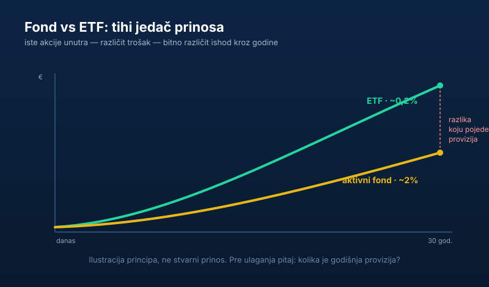

Investicioni fondovi zvuče kao san za početnika: daš pare, neki stručnjak ih ulaže umesto tebe, ti ne moraš ništa da znaš. Pa gde je kvaka?

Kvaka je, kao i obično, u sitnim slovima. Hajde da raščistimo **šta je bolje — investicioni fond ili ETF** — i kada koji ima smisla.

> **Napomena:** ovaj tekst je informativnog karaktera i ne predstavlja investicioni savet niti preporuku konkretnog proizvoda. Odluku donosiš sam, uz proveru zvaničnih dokumenata fonda.

## Kako fond radi

Investicioni fond skuplja pare od mnogo ljudi i ulaže ih po nekoj strategiji. Ti kupiš „udeo" u fondu i tako indirektno postaješ vlasnik svega u šta fond ulaže. Zvuči lepo — i jeste, za pravu osobu.

Prednost je jasna: **diversifikacija i upravljanje bez muke.** Ne moraš sam da biraš akcije, neko to radi za tebe. U Srbiji su društva za upravljanje fondovima regulisana i nadzire ih <a href="https://www.sec.gov.rs/" target="_blank" rel="noopener">Komisija za hartije od vrednosti</a> — to znači da postoje pravila, ali ne znači da nema rizika ni troška.

## Problem: provizije koje tiho jedu

Evo gde početnici greše. Aktivno upravljani fondovi naplaćuju **naknadu za upravljanje** — svake godine, na ceo iznos, bez obzira da li su zaradili ili izgubili. Ponekad postoji i ulazna ili izlazna provizija.

Deluje sitno: „samo 2% godišnje". Ali ta 2% se naplaćuju **svake godine**, i kroz decenije, zbog efekta kamate na kamatu, pojedu ogroman deo tvog prinosa. Tihi jedač koji ne osetiš odmah, ali te skupo košta na dugi rok.

Mali primer da se vidi razmera: na ulog koji raste kroz 30 godina, razlika između naknade od 2% i naknade od 0,2% godišnje može na kraju da znači **desetine procenata manje** u tvom džepu. Iste akcije unutra — a krajnja suma bitno različita, samo zbog troška.

I još gore: **većina aktivnih fondova dugoročno ne uspe da nadmaši prosek tržišta.** Plaćaš stručnjaka, a on ti u proseku ne donosi više od običnog indeksa — često i manje, baš zbog troškova.

## Pa kada fond ima smisla?

Fondovi nisu zlo. Imaju mesto ako:

- apsolutno ne želiš sam ništa da biraš i spreman si da platiš za potpuni mir,
- biraš fond sa **niskim** provizijama, ne onaj sa najskupljim upravljanjem,
- ti je horizont jasan i razumeš u šta fond konkretno ulaže (pročitaj prospekt, ne reklamu).

## A šta je onda bolje za većinu?

Za većinu ljudi, **indeksni ETF** radi isti posao kao fond — instant diversifikacija — ali sa daleko nižim troškovima. Prati celo tržište, ne pokušava da bude pametniji od njega, i ne uzima ti masnu proviziju svake godine.

Drugim rečima: dobijaš prinos tržišta, bez da plaćaš nekome da pokušava (i obično ne uspeva) da ga nadmaši. To je ista logika kao kod [diversifikacije — ne stavljaš sva jaja u jednu korpu](/blog/diversifikacija-portfolija/), samo što ti ETF tu korpu daje jeftino i odmah.

ETF kupuješ preko brokera, isto kao akcije — ceo postupak iz Srbije objasnili smo u vodiču [ulaganje novca u akcije](/blog/ulaganje-novca-u-akcije/). A ako tek krećeš sa skromnim iznosom, pogledaj i [gde uložiti prvih 1.000 evra](/blog/gde-uloziti-1000-evra/).

## Suština

Fondovi nisu prevara — ali nisu ni besplatni. Pre nego što uđeš, pitaj samo jedno: **kolika je ukupna godišnja provizija?** Ako je visoka, dobro razmisli da li ti isti posao indeksni ETF ne bi obavio jeftinije.

Tvoj prinos je tvoj. Nemoj ga davati nekome ko ti ne donosi vrednost za to.
